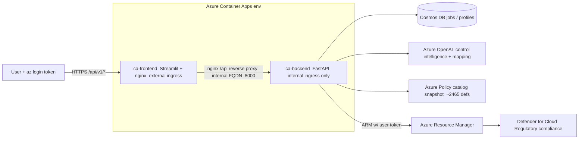

# ComplianceIQ architecture

ComplianceIQ turns a compliance regulation (a PDF of controls) into a deployable
**Azure Policy initiative** and onboards it to **Microsoft Defender for Cloud**.
It is a two-tier app on Azure Container Apps.

## Tiers
- **Frontend** `ca-frontend-*` — Streamlit UI behind **nginx**, the only public
  entry point (external ingress, port 8501). nginx also serves an **`/api`
  reverse proxy** to the backend so external callers (this skill) can reach the
  internal API. See `infra.md`.
- **Backend** `ca-backend-*` — FastAPI, **internal ingress only** (port 8000).
  Not reachable from outside the Container Apps environment except via the
  frontend proxy.

## Pipeline (what happens inside `POST /pipeline/run`)
1. **PDF extraction** — text/controls pulled from the uploaded PDF.
2. **Control intelligence** — controls normalised/enriched (Azure OpenAI).
3. **Azure Policy mapping** — each control matched to built-in Azure Policy
   definitions using a TF-IDF search over the full Azure built-in catalog
   snapshot (`app/backend/app/data/policy_catalog/azure_policy_catalog.json`,
   ~2465 defs), **not** MCSB.
4. **Initiative build** — mapped policies assembled into an Azure Policy
   Set (initiative) JSON, stamped with `ASC` metadata so it surfaces under
   Defender for Cloud → Regulatory compliance.

## Deploy
`POST /deploy/initiative` uses the **caller's ARM token** to create the policy
set definition (and optionally an assignment) at a subscription or management
group scope. `enforce_mode=false` (DoNotEnforce / audit-only) is the default.

## Data
- **Cosmos DB** — pipeline job status (fallback beyond the in-memory store) and
  user workspace data (uploads, mappings, exports, activity).
- Generated artifacts (`*_Initiative.json`, etc.) are written to the job's local
  `output_dir` on the backend replica that ran the job — see the replica caveat
  in `troubleshooting.md`.
