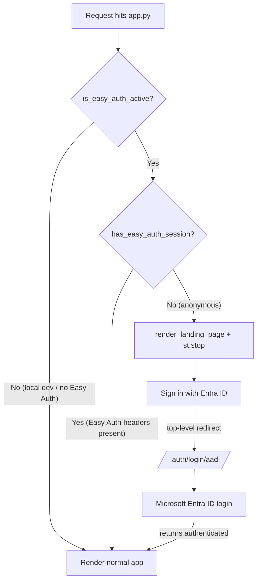
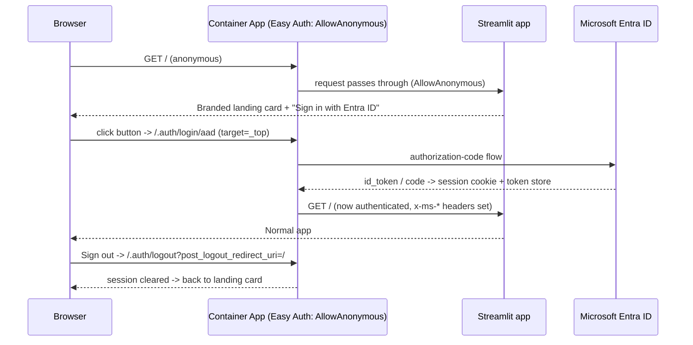

# Branded Entra ID Landing Page

Handover for the custom sign-in landing page that renders **before** the app for
unauthenticated visitors, replacing the forced Microsoft sign-in redirect.

## What changed & why

Previously the frontend Container App had Easy Auth set to
`unauthenticatedClientAction: RedirectToLoginPage`, so any anonymous request was
bounced straight to the Microsoft sign-in page — the app never got a chance to
render its own UI. We now:

1. Switch Easy Auth to **`AllowAnonymous`** (live app + IaC) so anonymous requests
   reach the Streamlit app instead of being pre-empted.
2. Gate the app entrypoint: unauthenticated users see a **branded landing card**
   with a *"Sign in with Entra ID"* button; authenticated users fall through to
   the normal app.
3. Sign-out returns the user to the landing page (Easy Auth logout with
   `post_logout_redirect_uri=/`).

Switching to `AllowAnonymous` does **not** change token storage or scopes — the
token store stays enabled and the same scopes are still requested at
`/.auth/login/aad`. It only stops the forced pre-auth redirect.

## Files

| File | Change |
| --- | --- |
| `app/frontend/utils/landing.py` | New. Branding/CSS, `render_landing_page()`, and the gate: `is_easy_auth_active()`, `should_show_landing()`, `require_login()`. |
| `app/frontend/utils/auth.py` | Added `get_login_url()`, `get_logout_url()`, `is_authenticated()`, and `has_easy_auth_session()` (header-only session check). |
| `app/frontend/app.py` | Calls `require_login()` right after the theme is injected, before session init / deep-link recovery. |
| `app/frontend/assets/logo.png` | Committed brand asset (original icon). |
| `app/frontend/assets/logo-icon.png` | Rounded-square hero icon rendered on the card (transparent corners). |
| `app/frontend/Dockerfile` | `COPY assets/` so the icons ship in the image. |
| `app/infra/core/container-app.bicep` | New `unauthenticatedClientAction` param (default `RedirectToLoginPage`) wired into the `authConfig`. |
| `app/infra/main.bicep` | Frontend module passes `unauthenticatedClientAction: 'AllowAnonymous'`; backend keeps the default. |
| `app/infra/main.json` | Recompiled from Bicep. |
| `app/tests/test_frontend_landing.py`, `app/tests/test_frontend_auth.py` | Tests for the gate decision, Easy-Auth detection, render output, and the header-only auth check. |

## How the gate decides

The gate is a pure decision plus two environment/probe helpers, so it is fully
unit-testable and cannot fire during local development:



- **`is_easy_auth_active()`** — true only when the app runs behind Container Apps
  Easy Auth. Detection: the `EASY_AUTH_ENABLED` env var as an explicit override,
  otherwise `CONTAINER_APP_NAME` (auto-injected only inside Container Apps) **and**
  `ENABLE_AUTH=true`. Locally neither is set, so the gate is a no-op and there is
  no local regression.
- **`has_easy_auth_session()`** — a **header-only** check (reads the
  `x-ms-client-principal-*` Easy Auth headers). It deliberately does **not** call
  `get_current_user()`, which in production would fall through to the interactive
  MSAL flow and try to launch a browser server-side. This is the key correctness
  fix over a naive `is_authenticated()` gate.
- **`should_show_landing(easy_auth_active, has_session)`** — pure function:
  `easy_auth_active and not has_session`.

## Sign-in / sign-out flow



The button is an anchor styled as a button with `target="_top"`, so the redirect
breaks out of any Streamlit iframe wrapper and navigates the top-level window
(a plain markdown link does not do this reliably). `st.link_button` is also
available on the pinned Streamlit version and is used for the sign-out control.

## Deploy

Deploy code changes with a remote ACR build — **never** `azd provision` / `azd up`
(blocked by a landing-zone subnet/NSG policy):

```bash
azd deploy frontend --no-prompt
```

The Easy Auth switch is a control-plane change applied directly to the live app
(it is also reflected in the Bicep/IaC for consistency):

```bash
az containerapp auth update \
  -n <frontend-container-app> -g <resource-group> \
  --unauthenticated-client-action AllowAnonymous
```

## Verify

```bash
# 1. Easy Auth is AllowAnonymous
az containerapp auth show -n <frontend-container-app> -g <resource-group> \
  --query "globalValidation.unauthenticatedClientAction" -o tsv     # -> AllowAnonymous

# 2. Anonymous root is served (not redirected to the Microsoft login)
curl -s -o /dev/null -w '%{http_code}\n' --max-redirs 0 https://<frontend-host>/   # -> 200

# 3. The Entra sign-in entrypoint redirects to Microsoft
curl -s -o /dev/null -w '%{http_code}\n' --max-redirs 0 \
  https://<frontend-host>/.auth/login/aad                                          # -> 302
```

Streamlit is a client-rendered SPA, so `curl` on `/` returns the bootstrap shell,
not the card markup — confirm the branded card visually in a real browser (or a
headless screenshot). The card must show the logo, `ComplianceIQ`, the tagline,
and the sign-in button; clicking it must reach the Microsoft login and return to
the authenticated app; sign-out must land back on the card.

### Tests

```bash
# Frontend unit tests (need Streamlit installed; backend on the path first to
# avoid the `app` package name colliding with frontend/app.py):
PYTHONPATH=app/backend:app/frontend python -m pytest \
  app/tests/test_frontend_landing.py app/tests/test_frontend_auth.py --noconftest -q
```

## Caveats

- `app/tests/test_state_management.py` has pre-existing failures on `main`
  (a backend session-route query-parameter naming mismatch) unrelated to this
  change; CI does not run that file. All landing/auth tests pass.
- A separate known issue — the ARM token store returning empty at runtime — is
  **out of scope** here and does not affect the landing page or the sign-in
  redirect.
- Two assets are committed: `logo.png` (original brand icon) and `logo-icon.png`
  (the cropped hero actually rendered on the card).
