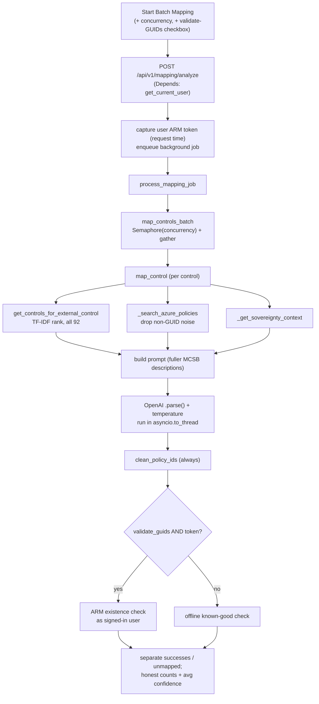
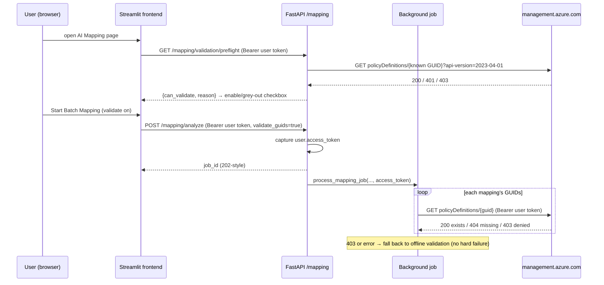

# AI Mapping Accuracy Improvements

**Status:** Complete (Phases 1–7). All changes committed on branch
`warrendt-literate-tribble`.

This document explains what the "▶️ Start Batch Mapping" feature did wrong, what
changed, and how to operate the new behaviour.

---

## 1. Why this work happened

Clicking **▶️ Start Batch Mapping** sends the uploaded external-framework
controls to the backend, which maps each one to a Microsoft Cloud Security
Benchmark (MCSB) control with Azure OpenAI. A review found six defects that hurt
accuracy, honesty, or speed. All six are now fixed.

| # | Defect (before) | Fix (after) |
|---|-----------------|-------------|
| 1 | MCSB candidate set was **9 hard-coded generic controls** — the configured data file didn't exist, so loading silently fell back to defaults. Every framework collapsed onto ≤9 controls. | Ship the real **92-control MCSB dataset** (`data/mcsb/mcsb_v1_controls.json`) + a generator + a weekly refresh workflow. |
| 2 | Candidate selection was **naive substring matching**. | Dependency-free **TF-IDF cosine ranking** over all 92 controls; the model sees them ordered by relevance (max recall, nothing excluded). |
| 3 | `ai_temperature` was **never applied** to the model call. | Temperature is forwarded, with a one-time graceful fallback for reasoning-model deployments that reject it. |
| 4 | AI-proposed `azure_policy_ids` were **unvalidated**, and the Learn client injected `"See documentation"` as a fake policy id. | GUIDs are cleaned, then verified against **ARM as the signed-in user** (opt-in) or an **offline known-good set** (default). |
| 5 | **Silent failures reported as success** — a failed mapping returned a placeholder that was counted as "mapped". | Failures are separated into `unmapped_controls`; counts and average confidence cover successes only; the UI lists failed control IDs. |
| 6 | **"Parallel workers" was false** — a sequential loop drove a blocking sync client and ignored the concurrency slider. | Real `asyncio.Semaphore` + `gather` concurrency; the blocking call runs in a worker thread; the slider value is honoured. |

---

## 2. End-to-end flow (after)



## 3. Identity flow for ARM GUID validation

Validation reuses the existing delegated-token pattern already used by the
policy-deploy feature. The background task cannot read request context, so the
caller's ARM token is captured at request time and passed into the job.



- `can_validate=false` (no token, 401, or 403) → the checkbox is disabled and the
  job uses offline validation. A permission problem never fails the job.
- ARM results are cached in-process for the job's lifetime (built-in policy
  existence is tenant-global and static).

---

## 4. New settings and request parameters

### Environment settings (`app/backend/.env.template`, `config.py`)

| Setting | Default | Meaning |
|---------|---------|---------|
| `MCSB_DESCRIPTION_MAX_CHARS` | `600` | Max chars of each MCSB control description sent in the prompt. `0` = full description. |
| `MCSB_CANDIDATE_TOP_K` | `0` | Top-ranked MCSB candidates sent per external control. `0` = all 92 (ranked). |
| `AI_TEMPERATURE` | `0.3` | Now actually applied (with reasoning-model fallback). |

### Per-request parameters (`MappingRequest`)

| Field | Default | Range | Meaning |
|-------|---------|-------|---------|
| `validate_guids` | `false` | bool | Verify `azure_policy_ids` against ARM as the caller. Falls back to offline if not permitted. |
| `concurrency` | `5` | 1–10 | Controls mapped in parallel. |

### New mapping output fields (`ControlMapping`)

| Field | Meaning |
|-------|---------|
| `invalid_policy_ids` | GUIDs ARM confirmed do **not** exist (dropped from `azure_policy_ids`). |
| `unverified_policy_ids` | GUIDs that could not be confirmed (offline mode; kept but flagged). |
| `policy_validation_mode` | `none` / `offline` / `arm`. |
| `mapping_failed` | `true` when the mapping is a placeholder needing manual review. |

---

## 5. ARM permission requirement

Full (ARM) GUID validation calls
`GET https://management.azure.com/providers/Microsoft.Authorization/policyDefinitions/{guid}?api-version=2023-04-01`
with the **signed-in user's delegated Entra ID token**.

Requirements:
- The user must sign in with Entra ID (Easy Auth), and the token audience must be
  ARM (`https://management.azure.com`). This is the same requirement the existing
  policy-deploy feature already relies on.
- Reading built-in policy definitions is available to any authenticated tenant
  member (built-ins are tenant-global), so no special role assignment is normally
  needed. If the tenant restricts ARM access, the preflight returns
  `can_validate=false` and the job uses offline validation.

> **[UNVERIFIED]** The exact Easy Auth login scope
> (`https://management.azure.com/user_impersonation`) is assumed to match the
> deploy feature's configuration; confirm against the deployed app registration
> if ARM validation returns 401/403 unexpectedly.

---

## 6. MCSB dataset refresh

The committed dataset is the offline source of truth and ships in the image. To
keep it current with ARM policy metadata:

- **Automated:** `.github/workflows/refresh-mcsb.yml` (weekly) regenerates the
  dataset from ARM and opens a PR (requires an Azure federated credential in CI).
- **Manual:**
  - `make refresh-mcsb` — offline regeneration from the committed MCSB initiative.
  - `make refresh-mcsb-arm` — regeneration using ARM metadata (needs an Azure token).

Generator: `app/backend/scripts/generate_mcsb_dataset.py`.
Derived known-good GUID index: `data/mcsb/azure_builtin_policy_index.json`.

---

## 7. Testing

All non-E2E tests pass (**229 total**). New suites:

| Suite | Tests | Covers |
|-------|-------|--------|
| `test_mcsb_dataset.py` | 14 | Real dataset loads (≥90 controls), GUIDs, domain prefixes. |
| `test_text_ranking.py` | 11 | TF-IDF ranking quality + full recall. |
| `test_ai_temperature.py` | 7 | Temperature forwarded + reasoning-model fallback. |
| `test_policy_validation.py` | 14 | GUID cleaning, offline/ARM annotation, preflight, ARM fallback. |
| `test_failure_accounting.py` | 5 | Failures reported as unmapped; honest counts. |
| `test_concurrency.py` | 6 | Semaphore bound, order preservation, monotonic progress. |

**Run commands** (from `app/`, with an env that has the backend deps but no
playwright):

```bash
# backend + shared
AZURE_OPENAI_ENDPOINT=https://dummy.openai.azure.com/ ENABLE_AUTH=false \
  PYTHONPATH=backend python -m pytest tests/ --ignore=tests/e2e \
  --ignore=tests/test_frontend_auth.py --ignore=tests/test_state_management.py \
  --ignore=tests/test_task_status_bar.py -q -p no:cacheprovider --noconftest

# the 3 frontend tests (need streamlit + backend-first path to avoid the
# `app` name colliding with frontend/app.py)
PYTHONPATH=backend:frontend python -m pytest tests/test_frontend_auth.py \
  tests/test_state_management.py tests/test_task_status_bar.py \
  -q -p no:cacheprovider --noconftest
```

`tests/conftest.py` is playwright-only, hence `--noconftest` when playwright is
absent.

---

## 8. Key files changed

- `services/text_ranking.py` — **new**, TF-IDF ranker.
- `services/policy_validation_service.py` — **new**, GUID cleaning + ARM/offline validation.
- `services/mcsb_service.py` — real dataset loading + ranked retrieval.
- `services/ai_mapping_service.py` — temperature, GUID cleaning, validation orchestration, concurrency.
- `services/microsoft_learn_client.py` — drop non-GUID policy noise.
- `api/routes/mapping.py` — auth + token capture, preflight endpoint, honest counts, concurrency threading.
- `models/mapping.py` — new mapping fields + request params.
- `frontend/pages/2_🤖_AI_Mapping.py`, `frontend/utils/api_client.py` — validation checkbox + preflight, honest result display, concurrency/validate wiring.
- `scripts/generate_mcsb_dataset.py`, `.github/workflows/refresh-mcsb.yml`, `Makefile` — dataset refresh.

---

## 9. Decisions & open questions

**Decisions**
- Retrieval sends **all 92 ranked** controls (max recall), configurable via `MCSB_CANDIDATE_TOP_K`.
- GUID validation defaults to **offline**; ARM is opt-in and gated by a preflight so a permissions gap degrades gracefully instead of failing.
- Failed mappings are **excluded from `mappings`** and listed in `unmapped_controls` so the review UI shows only real mappings.

**Open questions / risks**
- **[UNVERIFIED]** Easy Auth ARM scope (see §5) — confirm on the deployed app if ARM validation returns 401/403.
- The frontend time estimate uses a fixed `~45s/control` heuristic; it is now concurrency-aware but not measured against production latency.
- The refresh workflow needs an Azure federated credential configured in CI to run `--source arm`.
