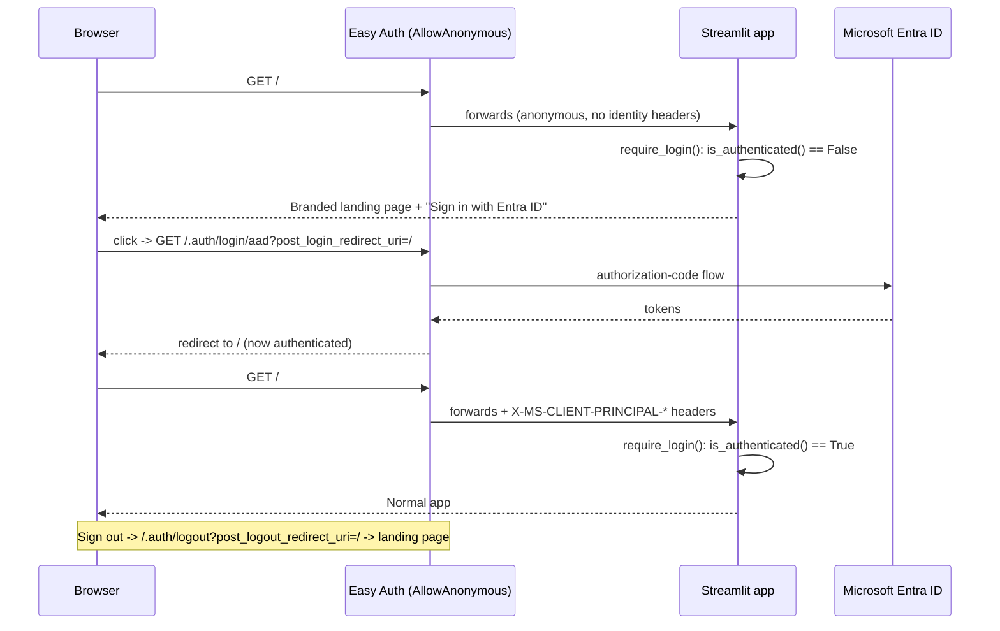
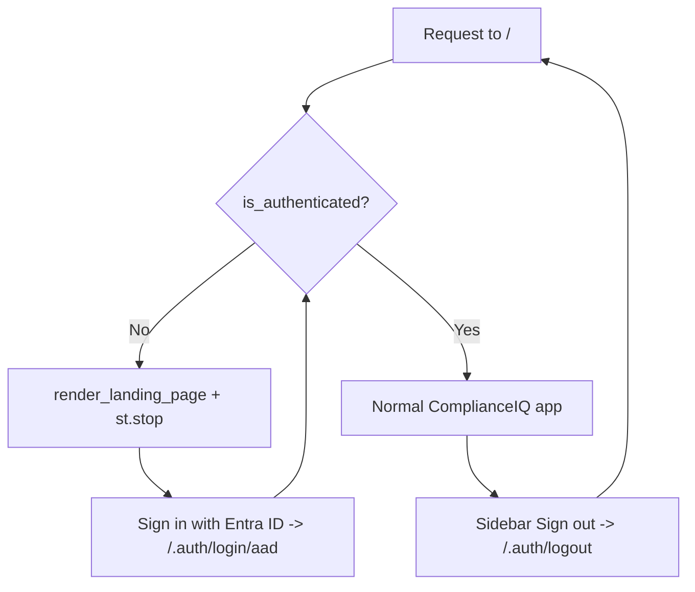

# Branded Entra ID Landing Page — Handover

## What & why
Previously the frontend forced every visitor straight to the Microsoft sign-in
page (Easy Auth `unauthenticatedClientAction: RedirectToLoginPage`). There was no
branded entry point. This change renders a **branded landing page first** for
unauthenticated users, with a **"Sign in with Entra ID"** button that starts the
Easy Auth login flow. After sign-in the normal app loads; sign-out returns to the
landing page.

## Current state
- Landing page renders for anonymous users and is styled to match the app logo
  (dark-navy → light-blue gradient, centered card, logo, product name, tagline,
  primary sign-in button).
- Easy Auth on the **frontend** container app is now `AllowAnonymous` (verified
  live) so the app gets a chance to render before login. The **backend** keeps the
  default forced-login redirect.
- Token store, scopes, and provider config are unchanged — only the
  pre-auth redirect behaviour changed.

## Files changed
| File | Change |
| --- | --- |
| `app/frontend/utils/auth.py` | Added `get_login_url()`, `get_logout_url()`, `is_authenticated()`. |
| `app/frontend/utils/landing.py` | New: `render_landing_page()` + `require_login()` auth gate. |
| `app/frontend/app.py` | Calls `require_login()` early so anonymous users see the landing page. |
| `app/frontend/assets/logo.png` | Committed brand asset. |
| `app/frontend/Dockerfile` | Ships `assets/` into the image. |
| `app/frontend/utils/state_init.py` | **Bug fix** (see below): added `recover_session_state()` + `clear_workflow_state()`. |
| `app/infra/core/container-app.bicep` | New `unauthenticatedClientAction` param (default `RedirectToLoginPage`). |
| `app/infra/main.bicep` | Frontend module passes `AllowAnonymous`. |
| `app/infra/main.json` | Regenerated from Bicep. |
| `app/tests/test_frontend_auth.py`, `test_frontend_landing.py`, `test_workflow_state_recovery_frontend.py` | Tests. |

## Pre-existing bug fixed along the way
`main`'s `app.py` imports `recover_session_state` and `clear_workflow_state` from
`utils.state_init`, but those functions were never defined there (only
`init_session_state`, `restore_workflow_state`, `persist_workflow_state` existed).
The frontend therefore failed to import at startup (`ImportError`) — `main` is
broken independently of this feature. Minimal, faithful wrappers over the existing
restore logic were added so the app imports and this feature can run. This overlaps
with in-flight work on `warrendt-improve-ai-mapping-accuracy`, which fixes the same
gap differently — reconcile on merge.

## How the redirect works




## Gate placement
`require_login()` runs in `app.py` right after theme injection and before session
recovery/deep-link handling, so anonymous users never trigger backend calls and no
sidebar/app chrome leaks behind the landing page (chrome is also hidden via CSS).

## Verify
1. **Anonymous landing** — open the frontend URL in a private window; the branded
   card should render (not a Microsoft redirect).
2. **Sign-in** — click *Sign in with Entra ID*; you should be sent to the Microsoft
   login and returned to the normal app.
3. **Sign-out** — use the sidebar *Sign out*; you should land back on the landing
   page.
4. **Auth config** —
   ```
   az containerapp auth show -n <frontend-container-app> -g <resource-group> \
     --query "globalValidation.unauthenticatedClientAction" -o tsv
   # expected: AllowAnonymous
   ```

## Deploy / config commands (run against your own environment)
```bash
# Code (remote ACR build) — never azd provision/up (blocked by landing-zone policy)
azd deploy frontend --no-prompt

# Live Easy Auth switch (control plane)
az containerapp auth update -n <frontend-container-app> -g <resource-group> \
  --unauthenticated-client-action AllowAnonymous
```

## Tests
Frontend unit tests (no backend deps required):
```bash
cd app
PYTHONPATH=backend:frontend pytest \
  tests/test_frontend_auth.py \
  tests/test_frontend_landing.py \
  tests/test_workflow_state_recovery_frontend.py
```

## Notes / caveats
- Individual `pages/*.py` are not separately gated; the entrypoint (`app.py`) is.
  With `AllowAnonymous`, backend calls made without identity headers still fail, so
  deep-linked pages degrade rather than expose data. Add `require_login()` to pages
  if hard gating is required.
- The known ARM token-store-empty-at-runtime issue is unrelated and untouched here.
- End-to-end authenticated sign-in was validated by design/logic and the Easy Auth
  `/.auth/login/aad` 302 to Entra; a full interactive login needs real credentials.
