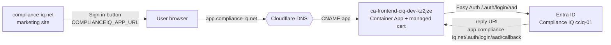

# Custom domain: `app.compliance-iq.net`

Binds the ComplianceIQ **frontend** Container App to `app.compliance-iq.net` with
a free, auto-renewing Azure Container Apps **managed certificate**, and repoints
the marketing site's **Sign in** button at the new domain.

## Why this shape

- **DNS is on Cloudflare** (external — there is no Azure DNS zone for
  `compliance-iq.net`). The `app` CNAME and `asuid.app` TXT verification records
  are therefore created **in Cloudflare**, not in Bicep.
- The marketing site (`compliance-iq.net` / `www`) already runs as a separate
  container app (`ca-complianceiq-site`) with managed certs bound the same way —
  `app.` follows that proven pattern.
- The dev environment's Easy Auth was configured **manually** (`azd` env has no
  `AUTH_CLIENT_*`). A full `azd provision` could disturb the live auth config, so
  the live binding is applied with the `az` CLI while the **Bicep encodes the same
  end state** for future clean deployments.

## Topology



## What is in code (IaC)

| File | Change |
| --- | --- |
| `app/infra/main.bicep` | `frontendCustomDomain` param; conditional `frontendCert` module; `customDomains` (SniEnabled) on the frontend app; `FRONTEND_CUSTOM_DOMAIN_URI` output |
| `app/infra/core/frontend-custom-domain.bicep` | Managed certificate (`subjectName`, `domainControlValidation: CNAME`) on the environment |
| `app/infra/core/container-app.bicep` | `customDomains` param wired into `ingress.customDomains` |
| `app/infra/main.parameters.json` | `frontendCustomDomain` ← `FRONTEND_CUSTOM_DOMAIN` env |
| `scripts/bind-frontend-custom-domain.sh` | Idempotent CLI apply of the same end state |

Default is empty → **no-op** for any environment that does not set the domain.

## Applying it (dev)

### 1. DNS in Cloudflare (manual — Warren) — **DNS only, not proxied**

| Type | Name | Value |
| --- | --- | --- |
| CNAME | `app` | `ca-frontend-ciq-dev-kz2jze.wittycliff-70fc9a98.southafricanorth.azurecontainerapps.io` |
| TXT | `asuid.app` | `B737DA736E6738489B9A9A0A3C96E64B8F76EADD40BE6FAB3C409CCF766C31DF` |

> The TXT value is the frontend app's `customDomainVerificationId` (environment
> scoped). Re-fetch anytime with:
> `az containerapp show -n ca-frontend-ciq-dev-kz2jze -g rg-complianceiq-dev-southafricanorth --query customDomainVerificationId -o tsv`

### 2. Bind hostname + managed certificate (after DNS propagates)

```bash
./scripts/bind-frontend-custom-domain.sh
```

### 3. Entra reply URL (done)

`https://app.compliance-iq.net/.auth/login/aad/callback` added to app
registration **Compliance IQ (cciq-01)** — existing URIs preserved.

### 4. Repoint the marketing Sign in button

```bash
az containerapp update -n ca-complianceiq-site -g rg-complianceiq-dev-southafricanorth \
  --set-env-vars COMPLIANCEIQ_APP_URL=https://app.compliance-iq.net
```

The site is env-driven (`docker-entrypoint.d/10-app-url.sh` rewrites `config.js`);
the placeholder in the repo is intentionally left unchanged (public repo).

## Verify

```bash
# cert issued + bound
az containerapp show -n ca-frontend-ciq-dev-kz2jze -g rg-complianceiq-dev-southafricanorth \
  --query "properties.configuration.ingress.customDomains" -o json

# front door responds on the custom domain (401 = Easy Auth up, healthy)
curl -s -o /dev/null -w '%{http_code}\n' https://app.compliance-iq.net/
```

## Notes / rollback

- Managed cert issuance requires the app to be reachable by DigiCert validation
  IPs — keep the CNAME **DNS only** in Cloudflare (grey cloud) during issuance.
- Rollback: `az containerapp hostname delete -n ... --hostname app.compliance-iq.net`,
  reset `COMPLIANCEIQ_APP_URL` to the raw FQDN, and remove the Entra reply URI.
- **Future clean deploys:** `azd env set FRONTEND_CUSTOM_DOMAIN app.compliance-iq.net`
  then `azd provision` reproduces the binding from Bicep (DNS records must exist first).
