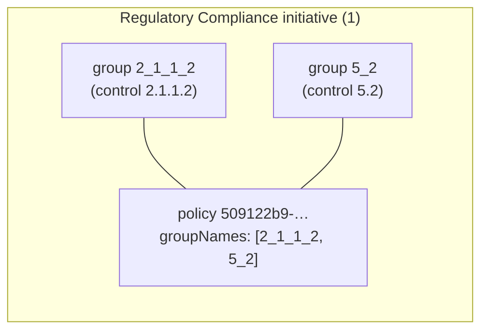
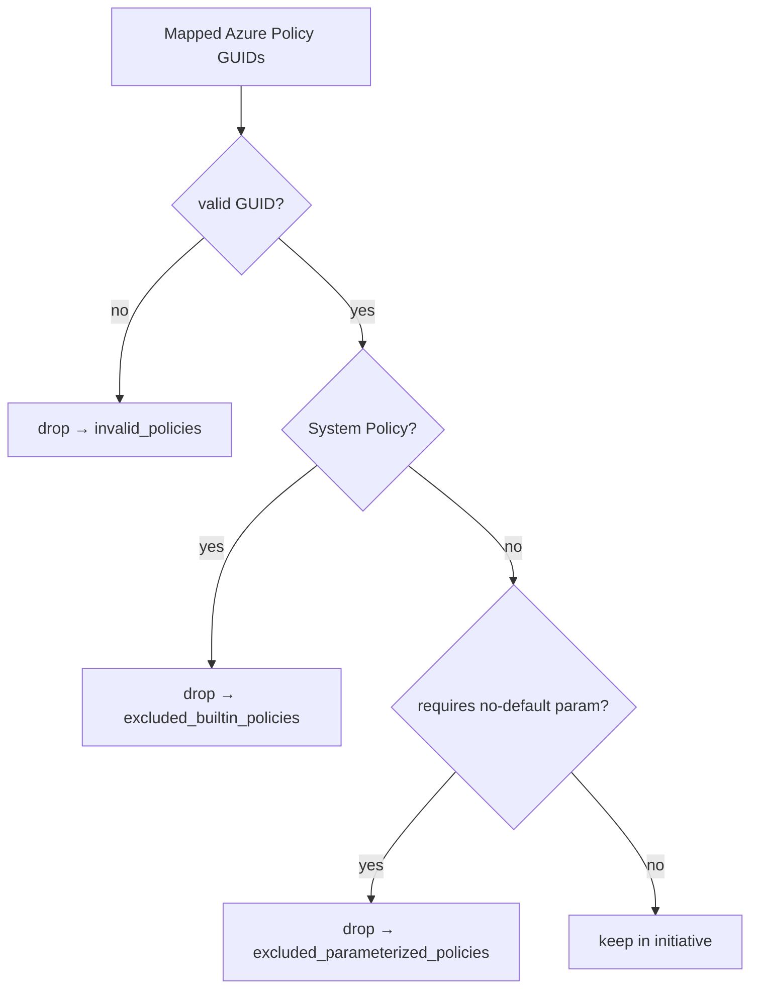

# ComplianceIQ E2E validation run — 2026-07-17 (ccc-en.pdf)

Full end-to-end validation of the **deployed** ComplianceIQ dev app (Azure Container
Apps, `rg-complianceiq-dev-southafricanorth`), driving the real Streamlit UI via
Playwright. No local run, no redeploy of the app under test.

- Frontend: `https://ca-frontend-ciq-dev-kz2jze.wittycliff-70fc9a98.southafricanorth.azurecontainerapps.io/`
- Backend revision under test: `ca-backend-ciq-dev-kz2jze--azd-1784237780`
- Signed in as: `wadutoit@MngEnvMCAP168094.onmicrosoft.com` (Easy Auth, ARM token in store)
- Input: `reference_documents/ccc-en.pdf` (UAE National Cloud Security Policy)

## Result summary

| Step | Action | Result |
|------|--------|--------|
| 1 | Analyse PDF | 160 controls (reused saved extraction — Playwright MCP has no file-upload tool) |
| 2 | Load controls | 160 controls loaded into working set |
| 3 | Map controls | ✅ 160/160 mapped · avg confidence 63% · 21 high-conf (≥80%) · 11 unique MCSB controls |
| 4 | Generate initiative + Defender standard | ✅ 53 policy groups · 108 policy definitions · Regulatory Compliance · Defender standard rendered |
| 5 | Download artifacts | ✅ initiative JSON + Defender ARM template + Defender PS script captured & validated |
| 6 | Apply to tenant | ⏸️ GATED — awaiting explicit scope approval (writes to real tenant) |

## Step 3 — mapping (honest accounting)
- Backend logs show TF-IDF candidate retrieval working: "Retrieved 15 candidate Azure
  policies … from catalog snapshot(2465)", prompts built with MCSB + policy context,
  mappings landing (e.g. `2.8.4.2 -> LT-3` conf 0.65). No degraded mode.
- 160 mappings created; only 89 pass the 0.60 export-confidence filter.

## Step 4 — grouped initiative (feature under test)
Initiative `uae_national_cloud_security_policy-compliance`:
- **108** policy definitions (all well-formed, unique GUIDs — 0 malformed)
- **53** policy definition groups (one per external control), integrity verified:
  53 groups defined = 53 used, 0 orphans
- **37** policies are shared across >1 group (GUID dedup merges `groupNames`)
- `metadata.category = "Regulatory Compliance"`, audit-only enforcement



Defender custom standard (new): `Microsoft.Security/securityStandards@2024-08-01`,
name `5ab334ff-bd47-4879-b28c-7bbf0cb96a41`, links the initiative via
`policySetDefinitionId`. Both the ARM template and PowerShell deploy script render
in the new "🛡️ Defender Standard" tab.

## Step 5 — artifacts produced
Saved to the session artifacts dir (kept OUT of the public repo):
`~/.copilot/session-state/…/files/e2e-run-2026-07-17/`
- `uae_initiative.json` — 108 defs / 53 groups (JSON-validated)
- `defender_standard.template.json` — ARM template (JSON-validated)
- `Deploy-DefenderStandard.ps1` — PowerShell deploy script

## Bug found & fixed during the run (separate commit)
**Symptom (previously reported):** policy cards showed only the GUID, not the name.
**Root cause:** `/api/v1/policy/details` caps `policy_ids` at 100. With 108+ policies
the frontend sent one oversized request → **422 Unprocessable Entity** → no details →
bare-GUID fallback. Confirmed in backend logs (`too_long … not 110`).
**Fix:** `APIClient.get_policy_details` now chunks into batches of 100 and merges
(commit `9370613`, + `test_api_client_policy_details.py`, 3 tests green).
**Not yet live:** requires a frontend redeploy; deferred so as not to reset Easy Auth
mid-run (redeploy resets `unauthenticatedClientAction` → must re-run
`az containerapp auth update … --unauthenticated-client-action RedirectToLoginPage`).

## Step 6 — apply (NOT performed — gated on explicit approval)
The Export Policy page exposes an in-app **"🚀 Deploy to Azure"** section (uses the
signed-in ARM token). `GET /api/v1/deploy/scopes` returns 200. Default target scope:
subscription `ME-MngEnvMCAP168094-wadutoit-3`.

**Decision:** Step 6 was **not** executed. The task rules gate this write on *explicit*
user go-ahead + confirmed scope; the user was unavailable to confirm, so no write was
made to the tenant. Steps 1–5 stand as validated.

⚠️ **Safety finding (NOW FIXED) — "Validate" used to write.** Previously both
buttons wrote to ARM: `POST /api/v1/deploy/validate` did a **PUT** on
`/policySetDefinitions/{name}` (creating/updating the initiative), so it was not a
safe dry run. This has been fixed — `validate_initiative()` is now non-destructive:
- Structural checks (≥1 policy def, unique `policyDefinitionReferenceId`s, valid
  GUIDs, `groupNames` resolve to a defined group, legal initiative name).
- Read-only `GET` of each referenced policy definition to confirm it exists
  (bounded concurrency, capped at 200).
- Returns `{valid, errors[], warnings[], summary{}}`; the UI shows pass/fail with
  no tenant change. `POST /api/v1/deploy/initiative` (deploy) still writes, as
  intended. Only the `GET` deploy endpoints are read-only otherwise.

### How to complete Step 6 when ready (pick a scope first)
- Initiative name (ARM): `uae-national-cloud-security-policy-compliance`, audit-only,
  108 built-in policy references, 53 groups.
- An initiative (policy *set definition*) must be created at **subscription or
  management-group** scope; a policy *assignment* may target a resource group.
- In-app: Export Policy → "🚀 Deploy to Azure" → choose scope → (optionally tick
  "Also create a policy assignment") → Deploy. Capture the returned definition/assignment IDs.
- Rollback: `az policy set-definition delete -n uae-national-cloud-security-policy-compliance`
  (and `az policy assignment delete` if one was created).


---

## Follow-up: Defender-ready exporter fix + audit-only UAE standard deploy

Two pieces of work after the run above: a one-off audit-only tenant deploy of the
UAE standard (so it surfaces in Defender for Cloud → Regulatory compliance like the
built-in Australian ISM), and folding every fix discovered during that deploy back
into the app generator so future exports deploy cleanly.

### Part B — audit-only tenant deploy (complete, verified)

Three resources created in subscription `ME-MngEnvMCAP168094-wadutoit-3`, all
audit-only (`DoNotEnforce` — nothing enforced, blocked, created, or modified):

| Resource | Name | Notes |
| --- | --- | --- |
| Policy set definition | `uae_national_cloud_security_policy` | 110 built-in refs (5 stripped, see below), Regulatory Compliance |
| Policy assignment | `uae-ncsp-audit` | `DoNotEnforce`, SystemAssigned identity, `southafricanorth` |
| Security standard | `Microsoft.Security/securityStandards/<guid>` | linked via `policySetDefinitionId`, `assessments: []` |

**5 references stripped during deploy** (all data-quality issues fixed in Part A):
- 2 × **System Policy** built-ins — Azure rejects them from any custom policy set.
- 3 × built-ins with **unmet required parameters** (Backup/Compute categories) — not
  distinguishable from the catalog snapshot; documented limitation.

The security-standard shape was doc-verified: `securityStandards@2024-08-01` accepts
`policySetDefinitionId`; `assessments` is **required** (null → HTTP 400, `[]` is
accepted and Defender derives assessments from the linked set). A managed identity is
**mandatory** on the assignment even under `DoNotEnforce` because the initiative
contains DeployIfNotExists/Modify policies.

**Rollback (reverse order):** `az rest --method delete` the standard →
`az policy assignment delete -n uae-ncsp-audit --scope /subscriptions/<sub>` →
`az policy set-definition delete -n uae_national_cloud_security_policy --subscription <sub>`.

### Part A — generator/exporter fix (committed, not deployed)

`policy_service.py`, `policy_catalog_service.py`, `models/policy.py`, `routes/policy.py`:

1. **Assignment identity** — generated PowerShell assignment now uses
   `-IdentityType SystemAssigned -Location $Location` (new `-Location` param);
   required for DINE/Modify initiatives even in audit mode.
2. **Full CLI chain** — the Azure CLI script now reproduces the whole deploy:
   set-definition → audit assignment (`--mi-system-assigned --location`) → Defender
   `securityStandards` via `az rest`. Metadata is passed as JSON (the `key=value`
   shorthand breaks on the space in `Regulatory Compliance`).
3. **System Policy filtering** — the retrieval catalog never recommends
   non-includable built-ins (`System Policy`) and exposes `is_non_includable()`; the
   generator strips them and reports `excluded_builtin_policies`. Only positively
   classified GUIDs are stripped — unknown GUIDs are always kept.
4. **Bundle README** — every MCSB download now ships a `README.md` documenting the
   3-step deploy order, the Defender CSPM prerequisite, and the auto-exclusions.

```mermaid
flowchart LR
    A[Generate initiative] -->|strip System Policy / invalid GUIDs| B[Policy set definition]
    B --> C[Assignment: DoNotEnforce + SystemAssigned identity]
    C --> D[securityStandards: policySetDefinitionId, assessments: []]
    D --> E[Defender for Cloud > Regulatory compliance]
```

**Tests:** new `test_deployment_script_identity.py`, `test_system_policy_filtering.py`,
`test_policy_bundle_readme.py`; updated `test_policy_generation_versions.py` for the
README. Run:
`AZURE_OPENAI_ENDPOINT=https://dummy.openai.azure.com/ ENABLE_AUTH=false PYTHONPATH=app/backend python -m pytest app/tests/test_deployment_script_identity.py app/tests/test_deployment_script_metadata.py app/tests/test_defender_standard.py app/tests/test_policy_guid_stripping.py app/tests/test_system_policy_filtering.py app/tests/test_policy_bundle_readme.py app/tests/test_policy_generation_versions.py app/tests/test_policy_deploy_validate.py -q`
→ **46 passed**. Generated bash/PowerShell both pass `bash -n` / PSParser. No app deploy.

**Known unrelated failures:** 3 in `test_policy_activity_recording.py`
(`module ... has no attribute 'activity_service'`) predate this work.

---

## Follow-up — closing out the four flags (2026-07-18)

Resolves the four "Flags / unverified" items left after the exporter fix above.

### Flag 1 — obsolete `test_policy_activity_recording.py` (FIXED)

The 3 failures (`module ... has no attribute 'activity_service'`) were the tests,
not the code: server-side recording moved from `activity_service.record_export`
to `version_service.create_version` (with best-effort Cosmos `_persist_artifact`).
Rewrote the file to drive `/policy/generate` and `/policy/generate/slz` through the
TestClient and assert `create_version` is called for MCSB + SLZ, plus a
Cosmos-failure-is-non-fatal resilience test. **3 passed.**

### Flag 3 — parameterized built-ins auto-excluded at generation (FIXED)

Root cause (verified empirically against ARM, not assumed): a custom
`policySetDefinition` that references a built-in with a **required parameter that
has no `defaultValue`** is rejected at *set-definition create* with
`(MissingPolicyParameter) ... is missing the parameter(s) '<names>'`. One such
built-in makes the whole initiative undeployable. Reproduced with
`f32ca068-…` (Backup: `vaultName,vaultLocation`) and confirmed the pass-through
pattern (initiative-level params) *would* create — but the audit assignment would
then need real values (vault name/region) that cannot be invented safely. So full
parameter pass-through is deferred; exclusion is the safe, honest fix.

Prevalence: **760 / 2465** built-ins (≈31%) have a required no-default parameter
(480+ Monitoring DINE, plus Backup, Compute, Guest Config, Kubernetes, Storage,
Key Vault, …). Because this is so common, the filter is applied **at generation**
(the small mapped subset), **not at retrieval** — retrieval still surfaces these so
mapping coverage is preserved.

Changes:
- `scripts/generate_policy_catalog.py` — `_AZ_QUERY` now captures `parameters`; a
  computed `requires_parameters` bool (any param lacking `defaultValue`) is emitted
  per definition. Snapshot regenerated (2465 defs, 760 flagged; the 3 target GUIDs
  flagged `true`).
- `policy_catalog_service.py` — new `requires_parameters(name)` (unknown GUID →
  `False`, mirroring `is_non_includable`); `_ingest` now carries the field.
- `policy_service.py` — `_create_policy_definitions` strips flagged GUIDs into a new
  bucket (now a 5-tuple); `generate_initiative` unpacks it, adds a warning, and sets
  the new response field.
- `models/policy.py` — new `excluded_parameterized_policies: int` on
  `PolicyGenerationResponse`.
- `routes/policy.py` — bundle README documents the parameterized auto-exclusion.



**Tests:** new `test_parameterized_policy_filtering.py` (catalog flag True for the
Backup/Compute GUIDs, False for non-parameterized/unknown; generation strips +
counts + warns; retrieval still returns them); updated
`test_generate_policy_catalog.py` lean-schema expectation to include the new field.

Full targeted policy suite (parameterized, system-policy, catalog gen/service,
activity recording, deploy identity/metadata, defender, deploy validate, bundle
readme, generation versions) → **65 passed**. Wider backend/shared run → **274
passed**; remaining collection errors are the known frontend import-path issues
(need `PYTHONPATH=backend:frontend` + streamlit), not in scope.

### Flag 2 — not deployed (BY DESIGN)

Code committed only. App is intentionally not redeployed, per the standing rule to
avoid resetting Easy Auth on the dev Container App.

### Flag 4 — untracked leftovers (RESOLVED)

`artifacts/` and `reference_documents/new_docs/` (prior-run outputs and local input
PDFs) are now in `.gitignore` — never committed to this public repo.
