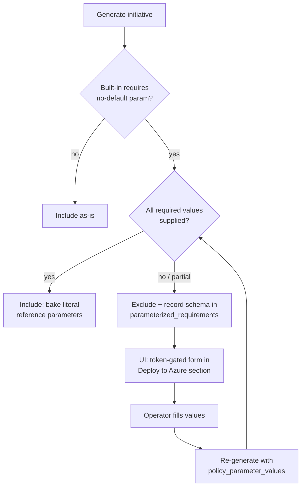
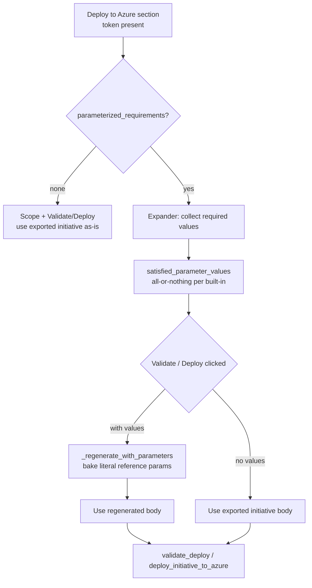
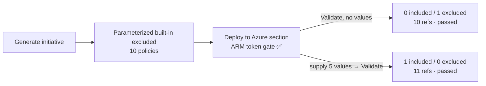
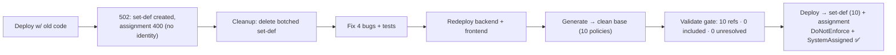

# Opt-in parameter prompts for parameterized built-ins — 2026-07-18

## What & why

Azure built-in policies that declare a **required parameter with no `defaultValue`**
(e.g. Backup's `vaultName`/`vaultLocation`, ASR's `sourceRegion`/`targetRegion`)
cannot be placed in a custom policy set unless a value is supplied — ARM rejects the
whole set definition with `MissingPolicyParameter`. The previous fix **excluded** all
such built-ins so the initiative deployed cleanly, but that silently dropped coverage
and the operator had no way to keep them.

This change makes inclusion **opt-in**: the exporter now captures each built-in's
required-parameter *schema* and surfaces it to the UI. When the operator supplies every
required value (in the token-gated *Deploy to Azure* section), the built-in is
**included** with those values baked in as literal reference parameters:

```jsonc
"policyDefinitions": [{
  "policyDefinitionId": ".../policyDefinitions/f32ca068-...",
  "parameters": { "vaultName": { "value": "rsv-prod" }, "vaultLocation": { "value": "southafricanorth" } }
}]
```

This shape is **self-contained** — no initiative-level parameters, no assignment-time
input. Verified empirically this session (temp set-def created + deleted cleanly).
Exclusion remains the default when no values are given; partial input keeps the
built-in excluded (matches the backend rule).

## Flow



## Changes

| Area | File | Change |
|------|------|--------|
| Catalog gen | `scripts/generate_policy_catalog.py` | `_required_parameter_schema()` returns `{name: {type, description?, allowed_values?}}` for no-default params; `normalize()` emits both `requires_parameters` (bool) and `required_parameters` (schema). |
| Catalog data | `app/backend/app/data/policy_catalog/azure_policy_catalog.json` | Regenerated — `required_parameters` schema per entry (760 flagged). |
| Catalog svc | `app/backend/app/services/policy_catalog_service.py` | `_ingest` carries `required_parameters`; new `get_required_parameters(name)`. |
| Models | `app/backend/app/models/policy.py` + `__init__.py` | New `PolicyParameterSpec`, `ParameterizedPolicyRequirement`; `policy_parameter_values` on request; `parameterized_requirements` on response. |
| Generator | `app/backend/app/services/policy_service.py` | `_create_policy_definitions(mappings, parameter_values)` — opt-in include (bake values) vs exclude+record; `_is_blank` helper; `PolicyDefinitionReference.parameters` now carries the literal values. |
| Route README | `app/backend/app/api/routes/policy.py` | Bundle README documents how to opt in. |
| Frontend API | `app/frontend/utils/api_client.py` | `generate_policy_initiative(..., policy_parameter_values)`; key omitted when empty (default behaviour unchanged). |
| Frontend page | `app/frontend/pages/4_📦_Export_Policy.py` | Excluded-count warning after summary; token-gated `_render_parameter_form` that collects values and re-generates. |

## Tests (all green)

- `test_parameterized_policy_filtering.py` (+4): include-when-supplied (asserts literal
  reference `parameters` + `excluded_parameterized_policies == 0` + Azure JSON),
  exclude-when-partial, requirement schema surfaced (name/type), catalog classification.
- `test_generate_policy_catalog.py` (+1): schema captured for no-default params.
- `test_api_client_generate_params.py` (new): payload forwards `policy_parameter_values`;
  key omitted when absent/empty.
- Full suite: **278 backend passed**; targeted policy group **58 passed**. The 8 e2e
  errors are pre-existing Playwright (no browser) — unrelated.

Run:
```bash
AZURE_OPENAI_ENDPOINT=https://dummy.openai.azure.com/ ENABLE_AUTH=false \
  PYTHONPATH=app/backend python -m pytest app/tests -q \
  --ignore=app/tests/e2e   # + frontend-collision files need PYTHONPATH=backend:frontend
```

## Deploy (2026-07-18)

Deployed code-only via `azd deploy` (remoteBuild in ACR; **no** provision — landing-zone
`Deny-Subnet-Without-Nsg` blocks provision, and code-only deploy does not touch the
infra-level Easy Auth config).

| Service | New revision | State |
|---------|--------------|-------|
| backend | `<backend-revision>` | Healthy · Running · 100% |
| frontend | `<frontend-revision>` | Healthy · Running · 100% |

Backend logged `Application startup complete` cleanly (new models/imports load).

## Fixes the reported Validate 400

The earlier "ARM returned HTTP 400 / `InvalidCreatePolicySetDefinitionRequest`" for
System Policy `f69cd8b8` was a **deploy gap**, not a code bug: the deployed revision
predated the non-destructive Validate (`c000c3f`), the System Policy strip (`272701a`)
and the parameterized strip (`10b0dd7`). This deploy ships all of them, so the offending
built-ins are no longer placed in the set and Validate no longer attempts a create.

## Unverified / caveats

- **Could not exec-verify the shipped catalog inside the container.**
  `az containerapp exec` requires a TTY and errors with `termios.error` in this
  non-interactive environment. Assurance instead rests on: `azd deploy` remoteBuild
  builds from the committed tree (which contains the regenerated catalog + new code),
  both revisions Healthy at 100%, and clean startup. **[UNVERIFIED in-container]**
- **`allowed_values`** is populated only when the built-in constrains a parameter; most
  no-default params (vault name/region) are free-form `String` → rendered as text inputs.
- **Frontend re-generate strategy**: the form re-calls `/policy/generate` with
  `policy_parameter_values` (mappings persist in `st.session_state`), rather than a
  targeted merge endpoint — simplest and keeps a single generation path.
- The 3 unmet-required built-ins stripped in a prior run were not catalog-distinguishable
  at the time; with the schema now captured they are eligible for opt-in inclusion.

## Rollback

Redeploy prior images if needed:
`<acr>.azurecr.io/compliance-iq/backend-dev:azd-deploy-1784037321`,
`.../frontend-dev:azd-deploy-1784037516` (via `az containerapp update --image`).

## Commit

`8966173` — Add opt-in parameter values to include parameterized built-ins.

---

## Update 2026-07-19 — collection moved INTO Validate/Deploy

Per the requirement *"ask the user to fill in vaultName/vaultLocation/sourceRegion/
targetRegion in the validation step … separate the policies out of the export UNLESS
the user opts to validate"*, the opt-in value collection was rewired out of a standalone
"Re-generate with these values" button and folded directly into the token-gated
**Validate** and **Deploy** actions. Parameterized built-ins remain excluded from the
downloadable export by default; they are only re-included when the operator supplies
values and clicks Validate or Deploy (both of which already require the ARM token).

### Behaviour



### Changes

| Area | File | Change |
|------|------|--------|
| Frontend helper | `app/frontend/utils/policy_parameters.py` (new) | Pure `satisfied_parameter_values(requirements, raw)` — returns only built-ins whose every required value is non-blank. Unit-testable without Streamlit. |
| Frontend page | `app/frontend/pages/4_Export_Policy.py` | Replaced `_render_parameter_form` (separate st.form + "Re-generate" button) with `_collect_required_parameters` (inline sticky inputs in an expander) + `_regenerate_with_parameters`. Validate and Deploy now re-generate with supplied values before calling ARM, and Validate shows an `N included / M excluded` caption. |
| Tests | `app/tests/test_policy_parameter_selection.py` (new) | 9 cases for `satisfied_parameter_values`: all-filled → included; partial/whitespace/missing → excluded; empty requirements; no-params / no-policy_id skipped; numeric + "0" kept as non-blank. |

### Tests (green)

- `test_policy_parameter_selection.py` — **9 passed**.
- Parameter group (`test_policy_parameter_selection` + `test_parameterized_policy_filtering` + `test_api_client_generate_params`) — **21 passed**.
- Full `app/tests` — **453 passed**, **11 failed**, **8 errors**. All 11 failures are the pre-existing `test_state_management.py` `init_session_state()` arg-mismatch (fail on clean `main`, unrelated — being addressed in a separate session). All 8 errors are pre-existing `e2e/` Playwright `FileNotFoundError` (no browser in this env). No new failures introduced.

Run:
```bash
AZURE_OPENAI_ENDPOINT=https://dummy.openai.azure.com/ ENABLE_AUTH=false \
  PYTHONPATH=app/backend:app/frontend .venv/bin/python -m pytest \
  app/tests/test_policy_parameter_selection.py -q
```

### Status

- Code committed: `af2f62f` — *Wire parameterized built-in values into Validate/Deploy*.
- **NOT deployed** and **NOT live-verified** yet. Redeploying the frontend and exercising
  the Validate button (with/without supplied vault/region values) against the real ARM
  token requires an interactive MFA re-login and may reset the operator's current Easy
  Auth session — deferred pending operator go-ahead. **[UNVERIFIED — live]**

---

## Live-verify 2026-07-19 — PASSED (deployed dev app + real ARM)

Frontend redeployed (rev `…azd-1784447979`, Healthy·100%) and exercised through the
Playwright-driven browser against the live dev Container Apps environment. Signed in as
`<operator>@…` (Easy Auth, SSO — no MFA re-prompt this run).

### Results

| Check | Outcome |
|-------|---------|
| ARM token present | `/.auth/me` → `access_token` with `aud = https://management.azure.com` ✅ |
| Deploy scope discovery | Target-scope selector populated (`Subscription: <subscription-name>`). The earlier `/deploy/scopes` **500 / "No subscriptions found"** did **not** reproduce with a fresh token ✅ |
| Validate — no values supplied | Caption **"Parameterized built-ins: 0 included, 1 still excluded"**; **10 policies · 4 groups · 10 references verified · 0 unresolved**; *Validation passed — no changes were made to your tenant* ✅ |
| Validate — values supplied | Caption **"Parameterized built-ins: 1 included, 0 still excluded"**; **11 policies · 4 groups · 11 references verified · 0 unresolved**; *Validation passed* ✅ |
| Server-side corroboration | Backend log: `POST /api/v1/deploy/validate → 200 OK` (~347 ms), Easy Auth user forwarded ✅ |

The delta is the proof: supplying the excluded built-in's required values re-includes it as
a literal-parameter policy — **10 → 11 policies, 10 → 11 references verified** — and it
passes real ARM validation. Both round-trips were dry-run (`no changes were made`).

The single excluded built-in in this dataset was **"Configure disaster recovery on virtual
machines by enabling replication via Azure Site Recovery"** (`ac34a73f-…`, used by control
D3), requiring `sourceRegion`, `vaultId`, `targetRegion`, `vaultResourceGroupId`,
`targetResourceGroupId` (all-or-nothing).

### Not done (gated)

- **Deploy** was **not** clicked — it writes to the real tenant and is gated on explicit
  operator go-ahead + confirmed scope (per E2E brief step 6).



---

## Deploy post-mortem + fixes — 2026-07-19 (PASSED)

The gated audit-only Deploy (E2E step 6) surfaced **four real bugs** on the first live
tenant write. All four are now fixed, tested, redeployed, and a genuinely clean audit-only
initiative + assignment was created and verified.

### The bugs

1. **Base `generated_policy` contamination.** `_regenerate_with_parameters` overwrote and
   persisted `st.session_state.generated_policy`, so any *Validate-with-values* permanently
   replaced the clean base initiative with the parameterized version. Later Deploys read the
   contaminated state.
2. **Sticky-param leak.** The base **Generate** call passed
   `policy_parameter_values=st.session_state.get(...)`, so once values were supplied they
   were baked into *every* subsequent generation.
3. **One-way door.** Once the built-in was included, the backend `parameterized_requirements`
   list emptied → the "➕ Include…" expander disappeared → the only UI path to clear the
   sticky values was gone. The built-in could never be excluded again in-session.
4. **Assignment missing identity/location (pre-existing).** `create_assignment` sent no
   `identity`/`location`. Assigning any initiative containing `DeployIfNotExists`/`Modify`
   policies returns ARM **400** (identity is mandatory even under `DoNotEnforce`). This was
   the 502 seen on the first Deploy: the set definition was created, the assignment 400'd →
   partial write (later deleted during cleanup).

### The fixes (commit on this branch)

- **Base Generate** no longer reads the sticky param store → base initiative is always the
  clean, exclude-by-default one, so `parameterized_requirements` stays populated and the
  expander never disappears (bugs 2 + 3).
- **`_regenerate_with_parameters` is transient** → it returns a fresh body for validate/deploy
  only and never mutates/persists `generated_policy` (bug 1).
- **`create_assignment` always attaches a `SystemAssigned` identity + `location`** and sets
  `enforcementMode` from the operator's Audit/Enforce toggle (`DoNotEnforce` = audit-only:
  compliance is still assessed, effects never applied — verified against Microsoft docs).
  `enforce_mode`/`location` are threaded through the deploy route + API client (bug 4).
- Tests: `test_policy_deploy_assignment.py` (pure `_build_assignment_body` cases) +
  `test_export_generate_state.py` (source-level regression guards for the two frontend paths).
  Full suite: **460 passed** (11 pre-existing state-mgmt fails deselected).

### Verified clean deploy (audit-only, subscription scope)

Redeployed backend + frontend (`azd deploy`, no provision). Easy Auth intact
(`RedirectToLoginPage`, token store on); ARM token `aud=management.azure.com`.

| Resource | Name | Key properties |
|---|---|---|
| Policy set definition | `dubai-cyber-security-strategy-2023-compliance` | Custom · **10 policy definitions** (parameterized built-in excluded, no placeholder IDs) |
| Policy assignment | `dubai-cyber-security-strategy-2023-compliance-assignment` | **`enforcementMode=DoNotEnforce`** (audit-only) · **`identity=SystemAssigned`** · linked to the initiative |

Server-side: `POST /api/v1/deploy/initiative → 200 OK` (~7.4 s), Easy Auth user forwarded.
Validate gate immediately before Deploy reported **10 policies · 4 groups · 10 references
verified · 0 unresolved · 0 included / 1 excluded**.

> Scope/subscription/tenant identifiers are intentionally omitted from this doc per the
> public-repo policy (no environment-specific IDs committed).

### Rollback (if needed)

```bash
az policy assignment delete -n dubai-cyber-security-strategy-2023-compliance-assignment \
  --scope /subscriptions/<subscription-id>
az policy set-definition delete -n dubai-cyber-security-strategy-2023-compliance \
  --subscription <subscription-id>
```


