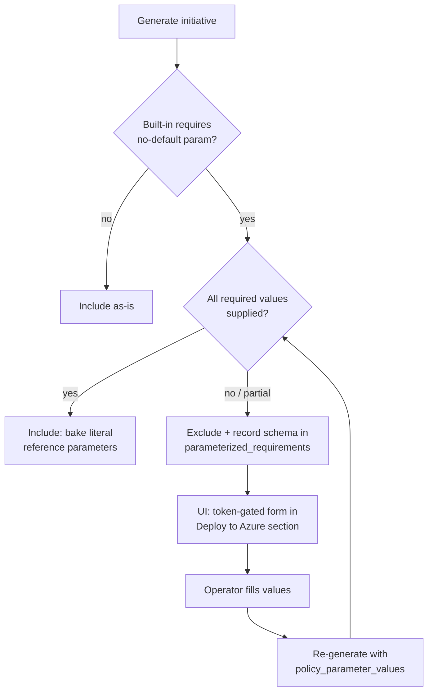

# Opt-in parameter prompts for parameterized built-ins — 2026-07-18

## What & why

Azure built-in policies that declare a **required parameter with no `defaultValue`**
(e.g. Backup's `vaultName`/`vaultLocation`, ASR's `sourceRegion`/`targetRegion`)
cannot be placed in a custom policy set unless a value is supplied — ARM rejects the
whole set definition with `MissingPolicyParameter`. The previous fix **excluded** all
such built-ins so the initiative deployed cleanly, but that silently dropped coverage
and the operator had no way to keep them.

This change makes inclusion **opt-in**: the exporter now captures each built-in's
required-parameter *schema* and surfaces it to the UI. When the operator supplies every
required value (in the token-gated *Deploy to Azure* section), the built-in is
**included** with those values baked in as literal reference parameters:

```jsonc
"policyDefinitions": [{
  "policyDefinitionId": ".../policyDefinitions/f32ca068-...",
  "parameters": { "vaultName": { "value": "rsv-prod" }, "vaultLocation": { "value": "southafricanorth" } }
}]
```

This shape is **self-contained** — no initiative-level parameters, no assignment-time
input. Verified empirically this session (temp set-def created + deleted cleanly).
Exclusion remains the default when no values are given; partial input keeps the
built-in excluded (matches the backend rule).

## Flow



## Changes

| Area | File | Change |
|------|------|--------|
| Catalog gen | `scripts/generate_policy_catalog.py` | `_required_parameter_schema()` returns `{name: {type, description?, allowed_values?}}` for no-default params; `normalize()` emits both `requires_parameters` (bool) and `required_parameters` (schema). |
| Catalog data | `app/backend/app/data/policy_catalog/azure_policy_catalog.json` | Regenerated — `required_parameters` schema per entry (760 flagged). |
| Catalog svc | `app/backend/app/services/policy_catalog_service.py` | `_ingest` carries `required_parameters`; new `get_required_parameters(name)`. |
| Models | `app/backend/app/models/policy.py` + `__init__.py` | New `PolicyParameterSpec`, `ParameterizedPolicyRequirement`; `policy_parameter_values` on request; `parameterized_requirements` on response. |
| Generator | `app/backend/app/services/policy_service.py` | `_create_policy_definitions(mappings, parameter_values)` — opt-in include (bake values) vs exclude+record; `_is_blank` helper; `PolicyDefinitionReference.parameters` now carries the literal values. |
| Route README | `app/backend/app/api/routes/policy.py` | Bundle README documents how to opt in. |
| Frontend API | `app/frontend/utils/api_client.py` | `generate_policy_initiative(..., policy_parameter_values)`; key omitted when empty (default behaviour unchanged). |
| Frontend page | `app/frontend/pages/4_📦_Export_Policy.py` | Excluded-count warning after summary; token-gated `_render_parameter_form` that collects values and re-generates. |

## Tests (all green)

- `test_parameterized_policy_filtering.py` (+4): include-when-supplied (asserts literal
  reference `parameters` + `excluded_parameterized_policies == 0` + Azure JSON),
  exclude-when-partial, requirement schema surfaced (name/type), catalog classification.
- `test_generate_policy_catalog.py` (+1): schema captured for no-default params.
- `test_api_client_generate_params.py` (new): payload forwards `policy_parameter_values`;
  key omitted when absent/empty.
- Full suite: **278 backend passed**; targeted policy group **58 passed**. The 8 e2e
  errors are pre-existing Playwright (no browser) — unrelated.

Run:
```bash
AZURE_OPENAI_ENDPOINT=https://dummy.openai.azure.com/ ENABLE_AUTH=false \
  PYTHONPATH=app/backend python -m pytest app/tests -q \
  --ignore=app/tests/e2e   # + frontend-collision files need PYTHONPATH=backend:frontend
```

## Deploy (2026-07-18)

Deployed code-only via `azd deploy` (remoteBuild in ACR; **no** provision — landing-zone
`Deny-Subnet-Without-Nsg` blocks provision, and code-only deploy does not touch the
infra-level Easy Auth config).

| Service | New revision | State |
|---------|--------------|-------|
| backend | `ca-backend-ciq-dev-kz2jze--azd-1784410037` | Healthy · Running · 100% |
| frontend | `ca-frontend-ciq-dev-kz2jze--azd-1784410215` | Healthy · Running · 100% |

Backend logged `Application startup complete` cleanly (new models/imports load).

## Fixes the reported Validate 400

The earlier "ARM returned HTTP 400 / `InvalidCreatePolicySetDefinitionRequest`" for
System Policy `f69cd8b8` was a **deploy gap**, not a code bug: the deployed revision
predated the non-destructive Validate (`c000c3f`), the System Policy strip (`272701a`)
and the parameterized strip (`10b0dd7`). This deploy ships all of them, so the offending
built-ins are no longer placed in the set and Validate no longer attempts a create.

## Unverified / caveats

- **Could not exec-verify the shipped catalog inside the container.**
  `az containerapp exec` requires a TTY and errors with `termios.error` in this
  non-interactive environment. Assurance instead rests on: `azd deploy` remoteBuild
  builds from the committed tree (which contains the regenerated catalog + new code),
  both revisions Healthy at 100%, and clean startup. **[UNVERIFIED in-container]**
- **`allowed_values`** is populated only when the built-in constrains a parameter; most
  no-default params (vault name/region) are free-form `String` → rendered as text inputs.
- **Frontend re-generate strategy**: the form re-calls `/policy/generate` with
  `policy_parameter_values` (mappings persist in `st.session_state`), rather than a
  targeted merge endpoint — simplest and keeps a single generation path.
- The 3 unmet-required built-ins stripped in a prior run were not catalog-distinguishable
  at the time; with the schema now captured they are eligible for opt-in inclusion.

## Rollback

Redeploy prior images if needed:
`crcomplianceiqdevkz2jze.azurecr.io/compliance-iq/backend-dev:azd-deploy-1784037321`,
`.../frontend-dev:azd-deploy-1784037516` (via `az containerapp update --image`).

## Commit

`8966173` — Add opt-in parameter values to include parameterized built-ins.
