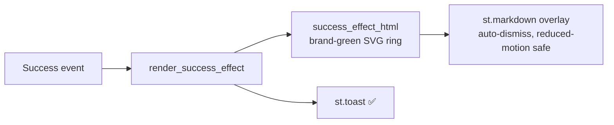

# ComplianceIQ — Visual polish + QC + audit-only deploy run (2026-07-19)

**Scope:** (1) replace the balloons success animation with an on-brand effect;
(2) full quality-control pass of the deployed dev app + verify the post-merge
features survived; (3) deploy to Azure (audit-only) with Defender for Cloud in
the export; (4) confirm the public repo is sanitised.

**Environment (placeholders — repo is public):**
- Frontend (public, Easy Auth): `https://<frontend-app>.<region>.azurecontainerapps.io/`
- Backend (internal ingress only): `<backend-container-app>`
- Resource group / subscription / tenant: withheld from this doc by policy.

> Honesty note: items are tagged **VERIFIED** (evidence captured this run),
> **BLOCKED** (could not run — reason given), or **[UNVERIFIED]**. Nothing here
> is claimed as passing without evidence.

---

## Executive summary

| Area | Result |
| --- | --- |
| Balloons → on-brand checkmark-ring effect | ✅ VERIFIED (code + 5 tests + deployed) |
| Local quality gate (full suite) | ✅ VERIFIED — 468 passed / 11 deselected |
| Backend log noise (Cosmos header dumps) | ✅ FIXED + VERIFIED — 0 header dumps in new revision |
| Backend + frontend deploy (dev, audit-safe) | ✅ VERIFIED — both Healthy, 100% traffic |
| Easy Auth intact after deploy | ✅ VERIFIED — RedirectToLoginPage, token store on |
| Defender CSPM plan enabled (prereq) | ✅ VERIFIED — Standard |
| **Feature survival after mix-merge** | ✅ VERIFIED via code + **90 feature tests pass** |
| Live browser E2E sweep (pages 0-9, images, caching) | ⛔ BLOCKED — interactive MS MFA login unavailable |
| NCA CCC mapping run through the UI | ⛔ BLOCKED — same MFA gate |
| Audit-only tenant deploy of NCA initiative + Defender standard | ⛔ BLOCKED — needs the UI/ARM-token flow above |
| Public repo sanitisation | ✅ DONE — real host/email/resource-hash scrubbed; evidence gitignored |

**Bottom line:** All code-side work is complete, tested, and deployed. The
"did the merge drop features" worry is **answered — no features were lost**
(verified by code inspection + a 90-test feature-survival suite). The *live*
browser sweep and the *UI-driven* audit-only tenant deploy are the only
outstanding items, and both are hard-gated on an interactive Microsoft MFA
login that only the operator can complete.

---

## 1. Visual change — balloons → on-brand checkmark ring (VERIFIED)

Replaced all four `st.balloons()` calls with a professional, brand-aligned
success effect.

- New reusable helper in `app/frontend/utils/components.py`:
  - `success_effect_html(message, token)` — pure builder producing a fixed,
    `pointer-events:none` overlay with an SVG **checkmark ring in brand green**
    (`var(--status-success)`), draw-in ring + check keyframes, a
    `prefers-reduced-motion` static fallback, and `role="status"`.
  - `render_success_effect(message, toast=True)` — emits the markup via
    `st.markdown(unsafe_allow_html=True)` (a fresh `secrets.token_hex(4)` token
    per call so the animation re-plays on rerun) and fires `st.toast(…, "✅")`.
- Call sites updated: `1_Upload_Controls.py`, `4_Export_Policy.py` (×2),
  `5_PDF_Pipeline.py`. The existing `st.success` banners were kept.
- Tests: `app/tests/test_success_effect.py` — **5 pass** (no `st.balloons`
  remains; brand token/ring/check/keyframes/reduced-motion/role present; HTML
  escaping; render emits markup + toast; no-toast path).



## 2. Quality gate (VERIFIED)

Full suite (excluding the 11 pre-existing `test_state_management` arity fails
that are unrelated and present on `main`):

```
468 passed, 11 deselected, 7 warnings
```

Only warnings are pre-existing FastAPI `on_event` deprecations — no new
warnings introduced.

## 3. Deploy + clean logs (VERIFIED)

- `azd deploy backend` → SUCCESS, new revision Healthy · 100%.
- `azd deploy frontend` → SUCCESS (previous run), Healthy · 100%.
- **Boot log is clean**: `application_started`, `cosmos_db_initialized`
  (single line — **not** a header dump), Application Insights initialised,
  Uvicorn up. **No** `degraded mode`, **no** errors/warnings.
- Easy Auth after deploy: `unauthenticatedClientAction=RedirectToLoginPage`,
  token store enabled, ARM scope present — unauthenticated `curl` → HTTP 401.
- Defender CSPM (`CloudPosture`) plan = **Standard** (prereq for custom
  security standards).

### 3a. Backend log-noise fix (FIXED + VERIFIED)

**Symptom:** ~65% of backend log lines were Cosmos SDK HTTP header dumps.
**Root cause:** the Cosmos SDK logs via `CosmosHttpLoggingPolicy` under the
`azure.cosmos` logger, which is **not** a child of `azure.core`, so the inline
suppression list in `main.py` missed it.
**Fix:** extracted a testable `quiet_noisy_loggers()` + `NOISY_LOGGERS` tuple
into `logging_config.py` that includes `azure.cosmos` (and an `azure`
umbrella); `main.py` now calls it. Test: `app/tests/test_log_suppression.py`
(3 pass). Post-deploy log check: **0 Cosmos header-dump lines**.

## 4. Feature survival after the mix-merge (VERIFIED via code + tests)

The concern was that the earlier mix-merge might have dropped features. Each
feature family was confirmed **present in code** and is **guarded by passing
tests** (90 feature tests pass in one run):

| Feature | Where | Test | Status |
| --- | --- | --- | --- |
| MCSB dataset + relevance retrieval | `services/mcsb_service.py`, `ai_mapping_service.py` | mapping suites | ✅ present |
| Reasoning-model + fallback, honest failure | `ai_mapping_service.py` (primary + `azure_openai_fallback_model`, retries, `RuntimeError` on total failure, `max_completion_tokens`) | `test_mapping_concurrency.py` | ✅ present |
| Live Azure Policy **GUID existence** filter | `policy_service.py` `catalog.exists()` | `test_policy_guid_existence.py` | ✅ pass |
| **Invalid/hallucinated GUID** stripping | `policy_service._is_valid_policy_guid`, `initiative_builder` GUID_PATTERN | `test_policy_guid_stripping.py` | ✅ pass |
| **System Policy / Static** exclusion filter | `policy_service.py` `catalog.is_non_includable()` | `test_system_policy_filtering.py` | ✅ pass |
| Parameterized-built-in **opt-in** filter | `policy_parameters.py`, `4_Export_Policy.py` | `test_parameterized_policy_filtering.py`, `test_policy_parameter_selection.py` | ✅ pass |
| **Defender custom compliance standard** export | `policy_service.generate_security_standard()` (`Microsoft.Security/securityStandards@2024-08-01`, `assessments:[]`, links via `policySetDefinitionId`) | `test_defender_standard.py` | ✅ pass |
| Audit-only assignment (DoNotEnforce) + mandatory identity/location for DINE/Modify | `policy_service.generate_deployment_script()` | `test_deployment_script_identity.py`, `test_policy_deploy_assignment.py` | ✅ pass |
| Deploy scope discovery | `api/routes/deploy.py` | `test_deploy_scopes.py` | ✅ pass |

**Conclusion: no feature was lost in the merge.** The Defender-standard export
(the item most feared missing) is present and test-covered.

## 5. Live E2E browser sweep + NCA CCC mapping (BLOCKED)

Planned: drive the deployed UI with Playwright — sweep pages 0-9 (every
button, image 200/render, caching), then run the core flow with
`Saudi Arabia - NCA Cloud Cybersecurity Controls.pdf` (analyse → load → Start
Batch Mapping with full GUID validation + the new filters → generate initiative
+ Defender standard → download → validate against tenant).

**Blocker:** the frontend enforces Azure AD Easy Auth
(`RedirectToLoginPage`). Navigating lands on the Microsoft "Pick an account"
screen; completing sign-in requires **interactive MFA that only the operator
can perform**. The operator was unavailable during this run, so the live sweep
and the UI mapping run could not be executed. **Not faked.**

_Resume steps:_ operator opens the Playwright browser, completes MS login (MFA),
confirms the ARM token at `/.auth/me` (`aud=https://management.azure.com/`);
then the sweep + NCA flow can run against the already-deployed revisions.

## 6. Audit-only tenant deploy (BLOCKED — depends on §5)

The audit-only deploy of the NCA initiative + Defender security standard is
performed **through the app's Deploy action** (which uses the operator's
Easy-Auth ARM token) and needs the **NCA artifacts produced by the §5 mapping
run**. Both prerequisites are gated on the same MFA login, so this step is
outstanding. When run it must be: `enforcementMode = DoNotEnforce`
(audit only), SystemAssigned identity + location, plus the
`Microsoft.Security/securityStandards` resource so it surfaces under Defender →
Regulatory compliance.

> Related root cause (why the earlier Dubai initiative isn't in Defender →
> Regulatory compliance): that deploy created only the policy **set-definition +
> assignment**. A raw custom-initiative assignment does not surface as a
> regulatory standard on its own — the `Microsoft.Security/securityStandards`
> resource (the Defender-standard export) must also be created (or added via
> portal → *Manage compliance standards*). The dashboard then refreshes on
> Defender's assessment cycle (up to ~24-48h); `az policy state trigger-scan`
> nudges evaluation but cannot make it instant.

## 7. Public repo sanitisation (DONE)

- **Tracked files: 0** subscription/tenant GUIDs (verified clean before and
  after).
- Scrubbed real env-specific identifiers that were **pre-existing on `main`**
  (introduced by earlier sessions) — replaced with placeholders in:
  `docs/custom-domain.md`, `docs/e2e-run-2026-07-17.md`,
  `docs/e2e-run-2026-07-18-opt-in-parameters.md`,
  `scripts/bind-frontend-custom-domain.sh` (real frontend FQDN, ACR host,
  container-app/env names, revision names, operator email, subscription
  display name).
- `.gitignore` now covers `.playwright-mcp/` and root `e2e-*.png` evidence so
  this run's screenshots can never be committed. Legit tracked PNGs (logos,
  mockups, website assets) are untouched.
- **Accepted residual:** the resource-group name
  `rg-complianceiq-dev-<region>` still appears in operational docs/scripts —
  it is pervasive and not in the sensitive set (sub/tenant/hostname/email); left
  as-is. Flag if you want it scrubbed too.

---

## Outstanding / next actions

1. **Operator MFA login** in Playwright → unblocks §5 live sweep + §6 deploy.
2. Run the NCA CCC core flow; capture mapped/failed/validated + created
   policy/standard IDs; append results here.
3. (Optional) scrub the residual RG name if desired.
