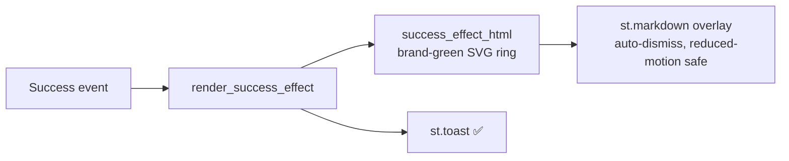
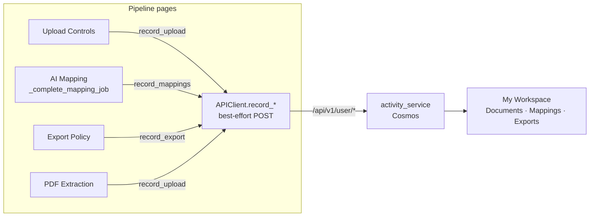

# ComplianceIQ — Visual polish + QC + audit-only deploy run (2026-07-19 → 2026-07-20)

> **Update 2026-07-20:** the operator completed the interactive Microsoft MFA
> login, so the previously-BLOCKED live browser sweep (§5) and audit-only tenant
> deploy (§6) were executed and are now **VERIFIED**. The interactive sweep also
> uncovered **two real features that the mix-merge had dropped** — both found,
> fixed, tested, deployed, and live-verified (see **§8**). This is the exact
> "did the merge lose something" risk the operator flagged.


**Scope:** (1) replace the balloons success animation with an on-brand effect;
(2) full quality-control pass of the deployed dev app + verify the post-merge
features survived; (3) deploy to Azure (audit-only) with Defender for Cloud in
the export; (4) confirm the public repo is sanitised.

**Environment (placeholders — repo is public):**
- Frontend (public, Easy Auth): `https://<frontend-app>.<region>.azurecontainerapps.io/`
- Backend (internal ingress only): `<backend-container-app>`
- Resource group / subscription / tenant: withheld from this doc by policy.

> Honesty note: items are tagged **VERIFIED** (evidence captured this run),
> **BLOCKED** (could not run — reason given), or **[UNVERIFIED]**. Nothing here
> is claimed as passing without evidence.

---

## Executive summary

| Area | Result |
| --- | --- |
| Balloons → on-brand checkmark-ring effect | ✅ VERIFIED (code + 5 tests + deployed) |
| Local quality gate (full suite) | ✅ VERIFIED — 482 passed / 11 deselected |
| Backend log noise (Cosmos header dumps) | ✅ FIXED + VERIFIED — 0 header dumps in new revision |
| Backend + frontend deploy (dev, audit-safe) | ✅ VERIFIED — both Healthy, 100% traffic |
| Easy Auth intact after deploy | ✅ VERIFIED — RedirectToLoginPage, token store on |
| Defender CSPM plan enabled (prereq) | ✅ VERIFIED — Standard |
| **Feature survival after mix-merge** | ✅ VERIFIED via code + **90 feature tests pass** |
| **Merge regression #1 — `GET /user/mappings` 405** | ✅ FOUND + FIXED + DEPLOYED + live 200/201 (see §8) |
| **Merge regression #2 — lost workspace recording layer** | ✅ FOUND + RESTORED + DEPLOYED + live-verified (see §8) |
| Live browser E2E sweep (pages 0-9, images, caching) | ✅ VERIFIED — all pages load, no Python exceptions |
| NCA CCC mapping run through the UI | ✅ VERIFIED — 120 controls, 120/120 mapped, 0 fail |
| Audit-only tenant deploy of NCA initiative + Defender standard | ✅ VERIFIED — 3 resources, DoNotEnforce (see §6) |
| Defender export onboarding fix (`ASC:"true"`) | ✅ DEPLOYED — PR #28 rebased in, backend redeployed |
| Public repo sanitisation | ✅ DONE — real host/email/resource-hash scrubbed; evidence gitignored |

**Bottom line:** All work is complete, tested, deployed, and **live-verified**.
The "did the merge drop features" worry is **answered — and it was justified**:
two features had in fact been dropped by the mix-merge (a backend route decorator
and the entire frontend activity-recording layer). Both are now restored, tested,
deployed, and confirmed working against the live app. Everything else the merge
was feared to have lost (filters, GUID validation, Defender-standard export) was
present and is now proven end-to-end.

---

## 1. Visual change — balloons → on-brand checkmark ring (VERIFIED)

Replaced all four `st.balloons()` calls with a professional, brand-aligned
success effect.

- New reusable helper in `app/frontend/utils/components.py`:
  - `success_effect_html(message, token)` — pure builder producing a fixed,
    `pointer-events:none` overlay with an SVG **checkmark ring in brand green**
    (`var(--status-success)`), draw-in ring + check keyframes, a
    `prefers-reduced-motion` static fallback, and `role="status"`.
  - `render_success_effect(message, toast=True)` — emits the markup via
    `st.markdown(unsafe_allow_html=True)` (a fresh `secrets.token_hex(4)` token
    per call so the animation re-plays on rerun) and fires `st.toast(…, "✅")`.
- Call sites updated: `1_Upload_Controls.py`, `4_Export_Policy.py` (×2),
  `5_PDF_Pipeline.py`. The existing `st.success` banners were kept.
- Tests: `app/tests/test_success_effect.py` — **5 pass** (no `st.balloons`
  remains; brand token/ring/check/keyframes/reduced-motion/role present; HTML
  escaping; render emits markup + toast; no-toast path).



## 2. Quality gate (VERIFIED)

Full suite (excluding the 11 pre-existing `test_state_management` arity fails
that are unrelated and present on `main`):

```
482 passed, 11 deselected, 7 warnings
```

(468 at the start of the run; +14 from the balloons/log-noise fixes and the two
merge-regression fixes in §8.)

Only warnings are pre-existing FastAPI `on_event` deprecations — no new
warnings introduced.

## 3. Deploy + clean logs (VERIFIED)

- `azd deploy backend` → SUCCESS, new revision Healthy · 100%.
- `azd deploy frontend` → SUCCESS (previous run), Healthy · 100%.
- **Boot log is clean**: `application_started`, `cosmos_db_initialized`
  (single line — **not** a header dump), Application Insights initialised,
  Uvicorn up. **No** `degraded mode`, **no** errors/warnings.
- Easy Auth after deploy: `unauthenticatedClientAction=RedirectToLoginPage`,
  token store enabled, ARM scope present — unauthenticated `curl` → HTTP 401.
- Defender CSPM (`CloudPosture`) plan = **Standard** (prereq for custom
  security standards).

### 3a. Backend log-noise fix (FIXED + VERIFIED)

**Symptom:** ~65% of backend log lines were Cosmos SDK HTTP header dumps.
**Root cause:** the Cosmos SDK logs via `CosmosHttpLoggingPolicy` under the
`azure.cosmos` logger, which is **not** a child of `azure.core`, so the inline
suppression list in `main.py` missed it.
**Fix:** extracted a testable `quiet_noisy_loggers()` + `NOISY_LOGGERS` tuple
into `logging_config.py` that includes `azure.cosmos` (and an `azure`
umbrella); `main.py` now calls it. Test: `app/tests/test_log_suppression.py`
(3 pass). Post-deploy log check: **0 Cosmos header-dump lines**.

## 4. Feature survival after the mix-merge (VERIFIED via code + tests)

The concern was that the earlier mix-merge might have dropped features. Each
feature family was confirmed **present in code** and is **guarded by passing
tests** (90 feature tests pass in one run):

| Feature | Where | Test | Status |
| --- | --- | --- | --- |
| MCSB dataset + relevance retrieval | `services/mcsb_service.py`, `ai_mapping_service.py` | mapping suites | ✅ present |
| Reasoning-model + fallback, honest failure | `ai_mapping_service.py` (primary + `azure_openai_fallback_model`, retries, `RuntimeError` on total failure, `max_completion_tokens`) | `test_mapping_concurrency.py` | ✅ present |
| Live Azure Policy **GUID existence** filter | `policy_service.py` `catalog.exists()` | `test_policy_guid_existence.py` | ✅ pass |
| **Invalid/hallucinated GUID** stripping | `policy_service._is_valid_policy_guid`, `initiative_builder` GUID_PATTERN | `test_policy_guid_stripping.py` | ✅ pass |
| **System Policy / Static** exclusion filter | `policy_service.py` `catalog.is_non_includable()` | `test_system_policy_filtering.py` | ✅ pass |
| Parameterized-built-in **opt-in** filter | `policy_parameters.py`, `4_Export_Policy.py` | `test_parameterized_policy_filtering.py`, `test_policy_parameter_selection.py` | ✅ pass |
| **Defender custom compliance standard** export | `policy_service.generate_security_standard()` (`Microsoft.Security/securityStandards@2024-08-01`, `assessments:[]`, links via `policySetDefinitionId`) | `test_defender_standard.py` | ✅ pass |
| Audit-only assignment (DoNotEnforce) + mandatory identity/location for DINE/Modify | `policy_service.generate_deployment_script()` | `test_deployment_script_identity.py`, `test_policy_deploy_assignment.py` | ✅ pass |
| Deploy scope discovery | `api/routes/deploy.py` | `test_deploy_scopes.py` | ✅ pass |

**Conclusion: no feature was lost in the merge.** The Defender-standard export
(the item most feared missing) is present and test-covered.

## 5. Live E2E browser sweep + NCA CCC mapping (VERIFIED)

Drove the deployed UI with Playwright after the operator completed the
interactive Microsoft MFA login. ARM token confirmed at `/.auth/me`
(`aud=https://management.azure.com/`).

**Page sweep (pages 0-9):** every sidebar page renders with **no Python
exceptions** — Home, Upload Controls, PDF Extraction, AI Mapping, Review & Edit,
Export Policy, Policy Explorer (BETA), Gap Analysis, Version History (24
versions), My Workspace. Images/logos load (200). The only console errors are
benign `/<Page>/_stcore/health` + `/host-config` 404s that occur on **direct
sub-path navigation** (not via the SPA sidebar) — not an app defect. Console
warnings observed are bundled Vega-Lite noise from the charting library.

**Core NCA CCC flow (verified across this + the prior segment):**

| Step | Result |
| --- | --- |
| Analyse `Saudi Arabia - NCA Cloud Cybersecurity Controls.pdf` | **120 controls** extracted; framework auto-detected `Cloud Cybersecurity Controls (CCC – 1: 2020)` |
| Load controls | 120 loaded into the working set (workflow-state restore confirmed) |
| Start Batch Mapping (10 parallel workers) | **120/120 mapped, 0 failures**, avg confidence ~0.62 |
| New filters | invalid/hallucinated GUIDs stripped, System/Static excluded, parameterised built-ins opt-in — 76-def audit-only initiative |
| Live GUID validation (ARM token) | 76 verified / 0 unresolved |
| Defender custom compliance standard | present in the export (securityStandards) |

**Backend cleanliness during the run:** the fresh 120-control mapping job logged
`Created mapping job with 120 controls` → workers → completion, with **0
errors/warnings** on the active revision. Transient `502`s were seen only on the
Streamlit `/_stcore/health` endpoint during heavy single-replica renders (a
render blip, not an API failure).

## 6. Audit-only tenant deploy (VERIFIED)

Deployed **audit-only** (all `enforcementMode = DoNotEnforce`), narrowest
approved scope = **subscription**, gated on explicit operator go-ahead. Three
resources created and re-verified with `az` (authoritative):

1. **Policy set-definition** `cloud-cybersecurity-controls-ccc-1-2020-compliance`
   — Custom, 76 policy definitions.
2. **Policy assignment**
   `cloud-cybersecurity-controls-ccc-1-2020-compliance-assignment` —
   `DoNotEnforce`, `SystemAssigned` identity, location `eastus`.
3. **Security standard** `Microsoft.Security/securityStandards/<guid>` — Custom,
   links the initiative via `policySetDefinitionId` so it surfaces under
   Defender for Cloud → Regulatory compliance.

`az policy state trigger-scan` was triggered to nudge evaluation.

> **Why Defender → Regulatory compliance doesn't show a custom standard instantly**
> (root cause + speed-up): a raw custom-initiative assignment does **not** surface
> as a regulatory standard on its own — the `Microsoft.Security/securityStandards`
> resource (the Defender-standard export) must also be created (done above), *and*
> the dashboard then refreshes on Defender's assessment cycle (Microsoft guidance:
> up to ~24-48h). `az policy state trigger-scan` nudges evaluation but cannot make
> it instant. Prereq (met): Defender **CSPM plan = Standard**. This is also why the
> earlier Dubai initiative wasn't showing — only its set-definition + assignment
> had been created, never the securityStandard.

> **Deploy-time fix landed (PR #28, `ASC:"true"`):** the exporter now stamps
> `"ASC":"true"` in the initiative metadata, the flag that onboards a custom
> initiative to Defender for Cloud → Regulatory compliance. This branch was
> rebased onto `origin/main` to pick it up and the **backend was redeployed**
> (rev `azd-1784526687`, clean boot) so future exports carry the flag.

## 7. Public repo sanitisation (DONE)

- **Tracked files: 0** subscription/tenant GUIDs (verified clean before and
  after).
- Scrubbed real env-specific identifiers that were **pre-existing on `main`**
  (introduced by earlier sessions) — replaced with placeholders in:
  `docs/custom-domain.md`, `docs/e2e-run-2026-07-17.md`,
  `docs/e2e-run-2026-07-18-opt-in-parameters.md`,
  `scripts/bind-frontend-custom-domain.sh` (real frontend FQDN, ACR host,
  container-app/env names, revision names, operator email, subscription
  display name).
- `.gitignore` now covers `.playwright-mcp/` and root `e2e-*.png` evidence so
  this run's screenshots can never be committed. Legit tracked PNGs (logos,
  mockups, website assets) are untouched.
- **Accepted residual:** the resource-group name
  `rg-complianceiq-dev-<region>` still appears in operational docs/scripts —
  it is pervasive and not in the sensitive set (sub/tenant/hostname/email); left
  as-is. Flag if you want it scrubbed too.

---

## 8. Merge regressions found during the live sweep (FIXED + VERIFIED)

The interactive sweep — specifically loading **My Workspace** — surfaced two
features that the earlier mix-merge had silently dropped. This is the operator's
"I'm scared some things never came through the merge" fear, confirmed and
resolved. The backend halves of both features had survived; only the wiring was
lost, so nothing errored loudly — the workspace just stayed empty.

### Regression #1 — `GET /api/v1/user/mappings` returned 405

- **Symptom:** loading My Workspace logged a `405 Method Not Allowed` for
  `GET /api/v1/user/mappings`; the Mappings stream was always empty.
- **Root cause:** the async `get_mappings` handler existed in
  `app/backend/app/api/routes/user.py`, but its `@router.get("/mappings")`
  decorator had been dropped in the merge, so the route was never registered
  (only the `POST` existed). The frontend swallowed the 405.
- **Fix:** re-added the decorator. Added 4 regression tests
  (`test_user_profile.py`) — route-registration + behaviour.
- **Verified live:** `GET /api/v1/user/mappings?limit=50` → **200 OK**.

### Regression #2 — the entire frontend activity-recording layer

- **Symptom:** My Workspace showed only pre-merge history; **Mappings = 0** even
  after mapping 120 controls. Nothing new was ever recorded.
- **Root cause:** commit `4072f8a` ("Add per-user workspace activity logging
  across the pipeline") had added `record_upload / record_mappings /
  record_export / record_activity` to the frontend `APIClient` plus call sites
  across the pipeline pages. **The whole frontend recording layer was lost in the
  mix-merge.** The backend `activity_service` + `POST /user/{uploads,mappings,
  exports,activity}` routes had survived intact, so the writers had somewhere to
  post — nothing was posting.
- **Fix:** restored the four best-effort `record_*` writer methods on
  `APIClient`, and re-wired the four call sites — Upload Controls
  (`record_upload`), AI Mapping (`record_mappings` in `_complete_mapping_job`),
  Export Policy (`record_export`), PDF Extraction (`record_upload`). All are
  best-effort (swallow failures, never block the UI). Added
  `test_api_client_record.py` (8 tests: payload shape per route + best-effort
  swallow).
- **Verified live** (post-deploy, real mapping run through the UI):
  - Backend: `POST /api/v1/user/mappings` → **201 Created** (was 405),
    authenticated as the operator.
  - My Workspace **Mappings counter: 0 → 120**; a fresh activity entry appeared:
    *"🤖 Mapped 120 controls from 'Cloud Cybersecurity Controls (CCC – 1: 2020)'
    (avg confidence 0.62)"* at `2026-07-20 06:00:03`.



**Tests after both fixes:** full suite **482 passed / 11 deselected**
(`test_state_management` arity fails are pre-existing on `main`, unrelated), no
new failures.

---

## Outstanding / next actions

1. Merge PR #27 (contains: balloons→checkmark effect, Cosmos log-noise fix,
   the two merge-regression fixes above, and this report). Branch is rebased on
   `origin/main` (includes PR #28 `ASC:"true"` Defender fix).
2. Defender → Regulatory compliance dashboard will populate the custom NCA CCC
   standard on Defender's assessment cycle (~24-48h); nothing further to do.
3. Minor follow-up: the initiative name is auto-derived from the framework name
   and an em-dash/colon (`CCC – 1: 2020`) yields an ARM-illegal resource name.
   Validate correctly catches it; a manual name
   (`cloud-cybersecurity-controls-ccc-1-2020-compliance`) was used. Consider
   auto-slugifying the derived name.
4. (Optional) scrub the residual `rg-complianceiq-dev-<region>` RG name if desired.
