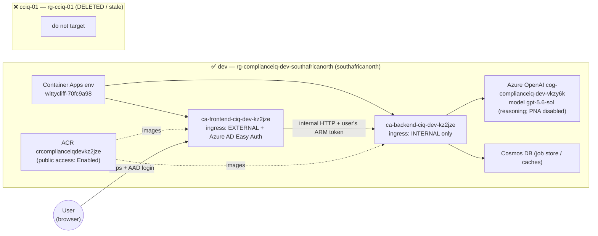
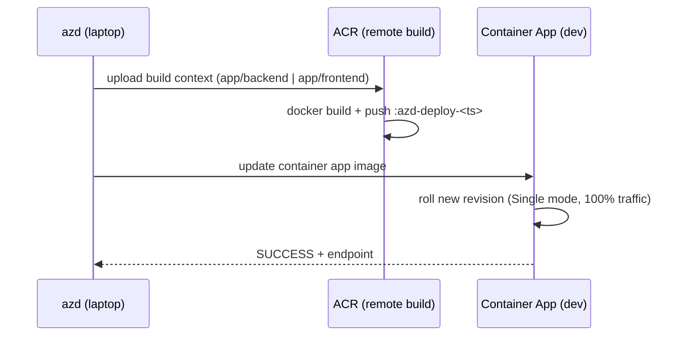
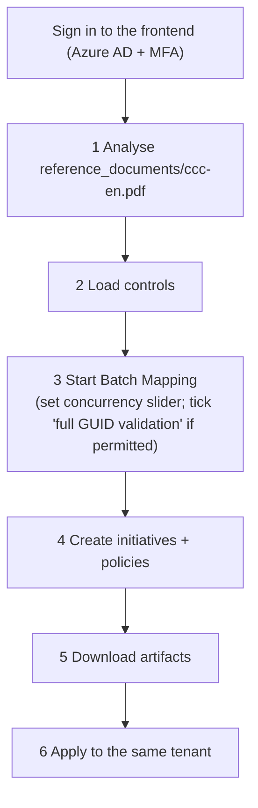

# E2E Validation Handover — AI Mapping Improvements on `azd` dev

**Branch:** `warrendt-literate-tribble`  ·  **Date:** 2026-07-15  ·  **Env:** `dev`
(`rg-complianceiq-dev-southafricanorth`)

## TL;DR
- The 7 AI‑mapping‑accuracy commits (real 92‑control MCSB dataset, TF‑IDF retrieval,
  temperature + reasoning‑model fallback, GUID validation, honest failure accounting, real
  concurrency, docs) plus a config/doc bug fix are on `warrendt-literate-tribble`.
- **Both backend and frontend were redeployed to the live `dev` env via `azd deploy`.** The
  previously deployed images were built **2026‑07‑14**, i.e. *before* these changes; the env
  now runs the latest code.
- **Verified:** clean deploy + clean boot of both new revisions; the 92‑control dataset is
  baked into the backend image (git‑verified).
- **Not verified (blocked):** the runtime `/health` values and the full 6‑step UI E2E
  (analyse → load → map → create → download → apply) require **interactive Azure AD sign‑in**
  on the frontend, which could not be automated while the user was away. A runbook to finish
  it in minutes is below.

---

## 1. Environment topology

Only **one** environment is live. The `cciq-01` env referenced by the sibling worktree
(`warrendt-sturdy-spoon/.azure/cciq-01`) is **stale** — its resource group `rg-cciq-01` has
been deleted.



Key facts:
- **Backend ingress is internal** → not reachable from a laptop; only the frontend (and other
  apps inside the env) can call it.
- **Frontend is gated by Azure AD Easy Auth** (`unauthenticatedClientAction =
  RedirectToLoginPage`) → every path returns `401`/redirect until the user signs in. The login
  scope includes `https://management.azure.com/user_impersonation`, so the app captures an ARM
  token used for GUID validation and for step 6 (policy apply).

---

## 2. What was deployed and how

Release method (the **only** supported one for this env):

```bash
# from the worktree root, with .azure/dev selected as the default azd env
azd deploy backend  --no-prompt
azd deploy frontend --no-prompt
```

- `remoteBuild: true` (root `azure.yaml`) → images build **in ACR**, nothing builds locally.
- **Never run `azd provision` / `azd up`** — blocked by the landing‑zone policy
  `Deny-Subnet-Without-Nsg`. `azd deploy` is code‑only: it builds+pushes the image and updates
  the container app; it does **not** touch infra or existing env vars (so OpenAI/Cosmos config
  is preserved).
- The `.azure/dev/.env` used to select the env (git‑ignored) mirrors the live outputs:
  `AZURE_ENV_NAME=dev`, `AZURE_RESOURCE_GROUP=rg-complianceiq-dev-southafricanorth`,
  `AZURE_LOCATION=southafricanorth`,
  `AZURE_CONTAINER_REGISTRY_ENDPOINT=crcomplianceiqdevkz2jze.azurecr.io`,
  `AZURE_SUBSCRIPTION_ID=2f454624-eba1-4906-86a5-158bdaebe202`, plus the two
  `SERVICE_*_IMAGE_NAME` values.



### Revisions after this session

| Service  | New image (latest code)                         | New revision                                  | Traffic |
|----------|-------------------------------------------------|-----------------------------------------------|---------|
| backend  | `backend-dev:azd-deploy-1784116069`             | `ca-backend-ciq-dev-kz2jze--azd-1784116232`   | 100%    |
| frontend | `frontend-dev:azd-deploy-1784116808`            | `ca-frontend-ciq-dev-kz2jze--azd-1784116961`  | 100%    |

### Rollback point (pre‑change images, Single revision mode)

| Service  | Old image                             | Old revision                                  |
|----------|---------------------------------------|-----------------------------------------------|
| backend  | `backend-dev:azd-deploy-1784037321`   | `ca-backend-ciq-dev-kz2jze--azd-1784037485`   |
| frontend | `frontend-dev:azd-deploy-1784037516`  | `ca-frontend-ciq-dev-kz2jze--azd-1784037651`  |

```bash
# Roll back either service if needed
az containerapp update -n <app> -g rg-complianceiq-dev-southafricanorth --image <old-image>
```

---

## 3. Verification matrix (honest)

| # | Claim | Status | Evidence |
|---|-------|--------|----------|
| 1 | Latest branch code deploys to `dev` | ✅ Verified | Two `azd deploy` runs returned `SUCCESS` (3m14s / 2m59s). |
| 2 | Backend image contains the real 92‑control MCSB dataset | ✅ Verified | `git show HEAD:app/backend/app/data/mcsb/mcsb_v1_controls.json` → **92 controls**; file is tracked, so baked into the image. `MCSB_DATA_PATH` config default resolves to it. |
| 3 | New backend revision boots cleanly | ✅ Verified | Logs: `application_started` (openai_model `gpt-5.6-sol`), `Uvicorn running`, `Application startup complete`. **No** error / `degraded` / `fallback` lines (Phase 1 logs the fallback loudly, so its absence means the 92‑control file loaded). |
| 4 | New frontend revision boots cleanly | ✅ Verified | Log: `You can now view your Streamlit app in your browser.`; no errors. |
| 5 | Both revisions serve 100% traffic (Single mode) | ✅ Verified | `az containerapp ingress traffic show` → LatestRevision = 100. |
| 6 | Runtime `/api/v1/health` = `azure_openai_connected: true`, `mcsb_control_count: 92` on the **new** revision | ⚠️ Not verified | Endpoint is lazy/on‑demand; backend is internal‑only; `az containerapp exec` needs a real TTY (`tty.setcbreak` → *Inappropriate ioctl for device*) and the PTY‑shim path returns a Container Apps control‑plane 500. Will emit `Successfully loaded 92 MCSB controls` + `Azure OpenAI connection test successful` on the first authenticated request. |
| 7 | Full 6‑step UI E2E (analyse→load→map→create→download→apply) | ⛔ Blocked | Requires interactive Azure AD sign‑in (MFA) + the user's ARM permissions for step 6. User was away. |

Assumptions / notes:
- `azd deploy` builds from the **working tree**. At deploy time the tree = branch HEAD (all 7
  fix commits) + the doc/template edits — so the running image contains every code fix.
- Config parity: `azd deploy` left env vars untouched, and the pre‑change revision was already
  observed healthy (`Azure OpenAI connection test successful`, Cosmos OK). Same config → the new
  revision is expected healthy, but this is inference, not a live probe (see row 6).

---

## 4. Runbook — finish the 6‑step E2E (needs the user)



1. Open `https://ca-frontend-ciq-dev-kz2jze.wittycliff-70fc9a98.southafricanorth.azurecontainerapps.io/`
   and sign in.
2. While signed in, confirm backend health from the logs:
   ```bash
   az containerapp logs show -n ca-backend-ciq-dev-kz2jze -g rg-complianceiq-dev-southafricanorth \
     --revision ca-backend-ciq-dev-kz2jze--azd-1784116232 --tail 200 --format text \
     | grep -iE "loaded .*MCSB|connection test|degraded"
   ```
   Expect `Successfully loaded 92 MCSB controls` and `Azure OpenAI connection test successful`;
   **no** `degraded mode`.
3. Run the 6 steps in the UI with `ccc-en.pdf`. New UI affordances to exercise: the
   **concurrency slider**, the **"Enable full GUID validation"** checkbox (greyed out unless the
   permission preflight passes), and the **failed‑controls list** in the summary.
4. If anything regresses, roll back using §2.

> If you'd like me to drive the UI via Playwright, sign in once in the Playwright browser and I
> can take over the clicks from there.

---

## 5. Open questions
- **Live health probe without a human:** current options are (a) user signs in and I read the
  logs / drive the UI, or (b) a temporary Container Apps *job* in the same env to curl the
  internal `/health` — not created here to avoid changing a shared dev env.
- **Frontend redeploy included** on purpose: Phases 4c/5/6 changed the UI (validation toggle,
  failure display, concurrency slider). Without it the E2E would have tested old UI against new
  backend.

## 6. Related docs
- `docs/ai-mapping-accuracy-improvements.md` — the design/what‑changed handover for the 7 fixes.
