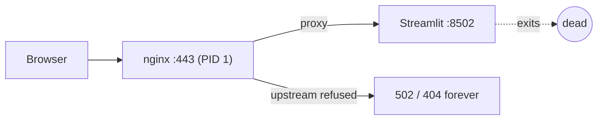

# Frontend "Connection error" (502 / 404) fix — Streamlit supervision

**Status:** Fixed in `app/frontend/start.sh`; deployed to dev.

## Symptom

Intermittently the app showed Streamlit "Connection error" dialogs:

- `502 Bad Gateway` (nginx/1.26.3) on the sign-in page
- `404 Not Found` (nginx/1.26.3) on deep links like `/Review_Edit`

Once it started, it stayed broken until the container was redeployed or
restarted.

## Root cause

The frontend container runs **nginx (foreground, PID 1)** reverse-proxying to
**Streamlit on 127.0.0.1:8502**, which `start.sh` launched as an **unsupervised
background process**:

```sh
streamlit run app.py --server.port=8502 ... &   # background
nginx -c /app/nginx.conf -g 'daemon off;'        # foreground / PID 1
```

If Streamlit ever exits, nginx keeps running, so:

- the container stays **Running** and ACA's ingress sees a live PID 1,
- there are **no liveness/readiness probes** configured to catch the dead
  upstream, and
- every request proxied to `:8502` returns `502` (or `404` for page routes).

The container is wedged permanently; only a manual redeploy/restart recovers it.

Diagnosis on the live replica confirmed:

- `:8502` was **CLOSED** while nginx served 502s,
- a fresh `streamlit run app.py` booted fine (app code is healthy),
- peak memory was **~212 MB against a 1 GiB limit**, so this was **not** OOM.



## Fix

Supervise Streamlit so it is restarted whenever it exits, keeping the app
self-healing. nginx remains the foreground process (so if *nginx* dies the
container still exits and ACA restarts it).

```sh
run_streamlit() {
    while true; do
        streamlit run app.py --server.port=8502 --server.address=127.0.0.1
        status=$?
        echo "[start.sh] Streamlit exited (status $status); restarting in 2s" >&2
        sleep 2
    done
}
run_streamlit &
trap 'kill "$!" 2>/dev/null || true' INT TERM EXIT
nginx -c /app/nginx.conf -g 'daemon off;'
```

Now a Streamlit exit yields a brief reconnect (~2 s) instead of a permanently
broken container.

## Verification

- `sh -n start.sh` passes.
- Behavioral harness (stubbed `streamlit`/`nginx` on PATH): Streamlit is
  relaunched after it exits (2 launches observed), nginx launches once, and the
  script exits cleanly when nginx stops (EXIT trap tears down the supervisor).
- Redeployed to dev; frontend boots and public URL returns the expected Easy
  Auth response (not 502).

## Follow-ups (not done here)

- Consider adding an ACA **liveness probe** (HTTP GET `/` or `/_stcore/health`)
  as defense-in-depth so ACA also restarts the container if both processes wedge.
  That is an infra/Bicep change and was out of scope for this code fix.
- The exact original trigger for Streamlit exiting was not captured (the
  death-time stderr had scrolled out of the log buffer); OOM is ruled out by the
  212 MB peak. The supervisor makes the trigger non-fatal regardless.
