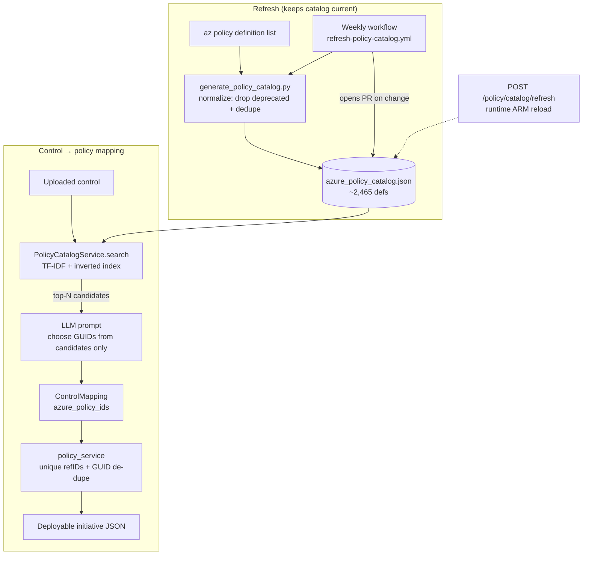

# Full-catalog policy mapping engine

Handover for the change that lets ComplianceIQ map external framework controls to the
**entire Azure built-in Policy catalog** instead of a small hard-coded control set.

## Why

A user reported the exporter "only exports 3 of 77". Root cause: control→policy mapping was
routed through a small MCSB control set, and when that dataset failed to load the backend fell
back to a 10-control stub exposing only **3** distinct Azure Policy GUIDs. Every generated
initiative was therefore capped at those 3 definitions regardless of how many controls the user
uploaded.

The fix removes the bottleneck: retrieval now runs against a snapshot of **all non-deprecated
Azure built-in policy definitions (~2,465)**, so any uploaded control can be matched to the most
relevant real policies.

## What changed

| Area | Change |
|------|--------|
| Catalog snapshot | `app/backend/app/data/policy_catalog/azure_policy_catalog.json` — 2,465 non-deprecated built-in definitions (lean projection: name/display_name/description/category/mode). |
| Generator | `scripts/generate_policy_catalog.py` — regenerates the snapshot from `az policy definition list` or an offline dump. Pure, unit-tested `normalize()` drops deprecated + dedupes. |
| Retriever | `app/backend/app/services/policy_catalog_service.py` — dependency-free TF-IDF over the catalog with an inverted index. `search(text, top_n)` returns ranked `PolicyCandidate`s. |
| Mapping | `ai_mapping_service._search_azure_policies` now pulls candidates from the catalog (off the event loop via `asyncio.to_thread`) and the prompt forces the model to pick GUIDs **only** from that candidate list. |
| Exporter fix | `policy_service._create_policy_definitions` emits a **unique** `policyDefinitionReferenceId` per (control, policy) and de-dupes policy GUIDs globally. Fixes the ARM "duplicate reference id" rejection (old Blocker B). |
| Visibility | `/health` reports `policy_catalog_count` + `policy_catalog_source`; `GET /policy/catalog/status` returns the same. |
| Refresh | `POST /policy/catalog/refresh` (auth-gated) reloads from ARM at runtime; scheduled `.github/workflows/refresh-policy-catalog.yml` regenerates the snapshot weekly and opens a PR. |

## Architecture



### Refresh layers

1. **Shipped snapshot** — baseline, always available offline.
2. **Generator script** — regenerate on demand from a live subscription or a captured dump.
3. **Scheduled workflow** — weekly regeneration, PR-gated so a human reviews the diff.
4. **Runtime endpoint** — `POST /policy/catalog/refresh` reloads from ARM using the backend
   identity (needs Reader on a subscription; degrades gracefully to the snapshot on failure).

## Tests

New unit tests (run in CI, `--noconftest`):

- `app/tests/test_policy_catalog_service.py` — tokenizer, load/count/source, relevance ranking
  (CMK / MFA / network queries), `get()`, missing-file and empty-query degradation,
  `refresh_from_definitions`, and a smoke test that the shipped snapshot loads >2,000 defs.
- `app/tests/test_policy_exporter_refids.py` — unique `policyDefinitionReferenceId` across one
  control with many policies and across many controls, GUID de-dupe, ref-id sanitisation.
- `app/tests/test_generate_policy_catalog.py` — `normalize()` drops deprecated (by display name and
  by version), dedupes, sorts, requires name+display, projects the lean schema; `build_catalog` header.

Run locally:

```bash
export ENABLE_AUTH=false AZURE_OPENAI_ENDPOINT=https://dummy.openai.azure.com \
       AZURE_OPENAI_DEPLOYMENT_NAME=gpt AZURE_OPENAI_API_KEY=x
PYTHONPATH=app/backend ./.venv/bin/python -m pytest \
  app/tests/test_policy_catalog_service.py \
  app/tests/test_policy_exporter_refids.py \
  app/tests/test_generate_policy_catalog.py -q
```

**Result:** 20/20 new tests pass. Full backend/shared suite: 215 passed. 3 pre-existing failures in
`test_policy_activity_recording.py` are unrelated (stale test references a
`policy_routes.activity_service` attribute the route no longer exposes — reproduced with these
changes reverted). Frontend tests are excluded here (need `PYTHONPATH=backend:frontend` + streamlit).

## End-to-end check (offline)

Mapping 3 sample controls through the catalog + exporter produced **12 policy definitions, all with
unique reference ids, 0 invalid dropped** — i.e. the "3 of 77" ceiling is gone; output now scales
with the controls and their matched policies.

## Verification after deploy

```bash
# catalog is loaded, not a stub
curl -s <backend>/health | jq '{policy_catalog_count, policy_catalog_source}'
# expect count ~2465, source "snapshot(...)"
```

Then re-run an in-app export and confirm the initiative contains many (not 3) policy definitions.

## Regenerating the catalog manually

```bash
python scripts/generate_policy_catalog.py --subscription <sub-id>
# or, offline, from a captured dump:
python scripts/generate_policy_catalog.py --raw <az-dump.json>
```

## Notes / unverified

- Runtime `refresh_from_arm` needs the backend managed identity to have **Reader** on a
  subscription. If it doesn't, the endpoint fails gracefully and the shipped snapshot stays in use
  (unverified whether the dev MI currently has that role).
- The scheduled workflow relies on the repo's existing OIDC secrets/vars
  (`AZURE_CLIENT_ID`, `AZURE_TENANT_ID`, `AZURE_SUBSCRIPTION_ID`) — no IDs are hard-coded.
- Deployment-/environment-specific run notes are kept in the local, untracked
  `docs/e2e-run-2026-07-15.md` (not committed to this public repo).
