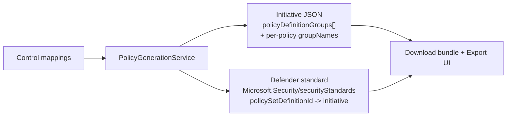

# Grouped Initiative + Defender Compliance Standard

## Why

Two problems with the generated Azure Policy artifacts:

1. **Not grouped.** The generated initiative listed every policy flat, unlike
   Azure's built-in regulatory-compliance initiatives (e.g. NIST 800-53, ISM
   PROTECTED) which group each policy under the source control it satisfies.
2. **Not "Compliance" type.** A plain policy set definition shows in Microsoft
   Defender for Cloud as **Custom (legacy)**, not as a first-class **Compliance**
   standard in the Regulatory Compliance dashboard.

Azure does not let customers publish built-in "Compliance"-type content (those
reference Microsoft-managed static `policyMetadata`). The supported custom path
is a Defender for Cloud custom standard. The user chose **Both**: a properly
grouped initiative **and** a Defender custom-standard wrapper.

## What changed



### Grouping
- `PolicyDefinitionReference` gains `group_names: List[str]`.
- New `PolicyDefinitionGroup` model (name, display_name, category, description).
- `PolicyInitiativeProperties` gains `policy_definition_groups`.
- `PolicyInitiative.to_azure_json()` emits `policyDefinitionGroups` and per-policy
  `groupNames`.
- `_create_policy_definitions()` now builds **one group per external control**
  (`displayName = "{control_id}: {control_name}"`, `category = mcsb_domain`),
  dedupes each policy GUID globally, and **merges** `groupNames` when the same
  policy satisfies multiple controls.
- Bicep export and the MCSB PowerShell/CLI deploy scripts pass groups as separate
  arrays (`-GroupDefinition` / `--definition-groups`), which is how Azure applies
  grouping (a plain `{properties:{...}}` wrapper never grouped).

### Defender custom standard
- New `PolicyGenerationService.generate_security_standard()` produces:
  - `{stem}_defender_standard.json` - ARM template with a
    `Microsoft.Security/securityStandards@2024-08-01` resource
    (`cloudProviders: ["Azure"]`, `policySetDefinitionId` parameter, name = GUID).
  - `Deploy-{stem}DefenderStandard.ps1` - resolves the initiative's resource ID
    and PUTs the standard via `Invoke-AzRestMethod`.
- Both files are added to the download bundle (`_mcsb_version_payload`), the
  `/policy/generate` response, and the Cosmos artifact doc.
- A new **Defender Standard** tab in `4_Export_Policy.py` shows both artifacts and
  documents the prerequisite.

> **Prerequisite:** the Microsoft Defender **CSPM** plan must be enabled on the
> target scope for the standard to appear under Regulatory Compliance.

## Verification

All policy tests pass (28):
```
PYTHONPATH=app/backend ENABLE_AUTH=false \
AZURE_OPENAI_ENDPOINT=https://dummy.openai.azure.com \
AZURE_OPENAI_DEPLOYMENT_NAME=gpt AZURE_OPENAI_API_KEY=x \
.venv/bin/python -m pytest \
  app/tests/test_policy_generation_versions.py \
  app/tests/test_initiative_grouping.py \
  app/tests/test_defender_standard.py \
  app/tests/test_policy_exporter_refids.py \
  app/tests/test_policy_guid_stripping.py \
  app/tests/test_deployment_script_metadata.py --noconftest -q
```

New tests: `test_initiative_grouping.py` (groups + groupNames, dedup/merge across
controls, deploy scripts carry `-GroupDefinition` / `--definition-groups`) and
`test_defender_standard.py` (securityStandards shape, api-version 2024-08-01,
`policySetDefinitionId` link, GUID name).

Smoke test confirmed a policy shared by two controls emits a single reference
with `groupNames == ['<control_a>', '<control_b>']`.

## Current state / what remains

- [x] Grouping models + `to_azure_json`
- [x] Grouping in service generate, Bicep, MCSB deploy scripts
- [x] Defender custom-standard generator + bundle wiring + Export UI tab
- [x] Tests (grouping + standard); existing regression tests green
- [x] Committed (`36194e7`)
- [ ] **Deploy to live dev** (`azd deploy backend --no-prompt` then
      `azd deploy frontend --no-prompt`) - pending user go-ahead
- [ ] Post-deploy verification in the live UI

## Notes / unverified

- Pre-existing unrelated failure: `test_policy_activity_recording.py::TestSlzRecording`
  references `policy.activity_service` which does not exist. Fails on `main` too;
  out of scope.
- Frontend Streamlit tests need `PYTHONPATH=app/backend:app/frontend` + streamlit;
  not run here.
- The SLZ generation path was intentionally left unchanged.
