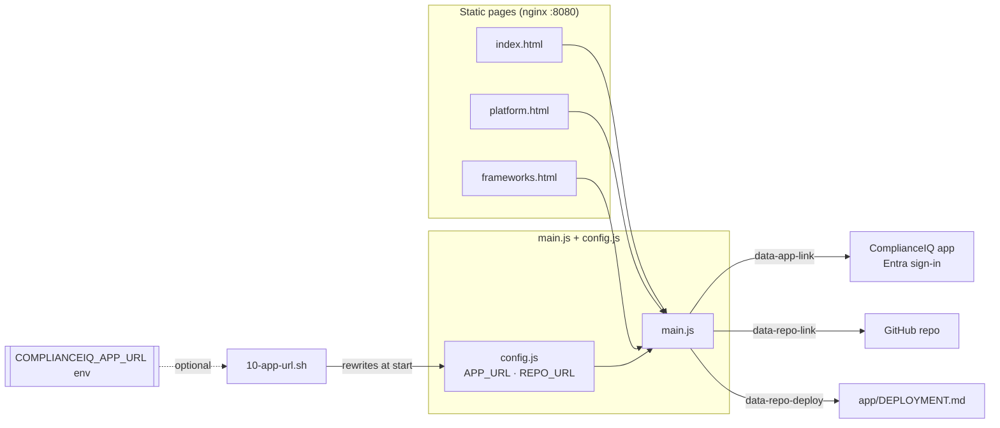

# Handover — ComplianceIQ Marketing Website

**Branch:** `warrendt-marketing-website` · **Scope:** new top-level `website/`
folder + this handover doc only. Nothing under `app/`, `azure.yaml`, or
`app/infra/**` was touched.

> **Revision (2026-07-16).** Corrected the frameworks to the **7 standards the
> product actually ships** (regional Gulf/Africa catalogs — see below), and
> turned the nav/CTAs into **real working destinations**: added `platform.html`
> (architecture) and `frameworks.html` (detailed frameworks), wired Resources →
> GitHub, Get started → `app/DEPLOYMENT.md`, Sign in → app. The v1 build showed a
> placeholder framework set (NIST/CIS/ISO/FedRAMP/HIPAA/GDPR) and on-page anchors.

## What was built

A standalone, static marketing site for ComplianceIQ (3 pages), served by
`nginx:alpine`. Zero build step, no framework.

- **`index.html`** — sticky navy nav (logo + Platform/Frameworks/Resources +
  Sign in + Get started) · hero with rebuilt HTML/CSS/SVG **pipeline diagram**
  (a real control, `SAMA-AC-01 Strong authentication` → AI mapping → Azure Policy
  / Defender guidance → Review, 92% confidence) · trust bar · **7 supported
  frameworks** cards · **How it works** · navy footer.
- **`platform.html`** — the three Microsoft targets (Defender for Cloud, M365
  Compliance, Purview), an architecture diagram (Streamlit → FastAPI → Azure
  OpenAI + Cosmos DB), and the Azure infrastructure grid.
- **`frameworks.html`** — how frameworks are managed & deployed (4-step
  lifecycle), the 7 supported standards with region/sector/policy-count, and the
  audit-only deployment model (`DoNotEnforce`, GUID validation).

### The 7 supported frameworks (authoritative — repo `README.md`)

| Mark | Framework | Region | Sector | Policies |
| --- | --- | --- | --- | --- |
| SAMA | SAMA Cybersecurity Framework | Saudi Arabia | Financial | 48 |
| ADHICS | Abu Dhabi Healthcare Information & Cyber Security v2 | Abu Dhabi | Healthcare | 50 |
| KSA | Saudi Arabia Government Cloud Security Controls | Saudi Arabia | Government | 58 |
| NDMO | NDMO Data Management & Personal Data Protection | Saudi Arabia | Data governance | 38 |
| NCA | NCA Critical Systems Cybersecurity Controls (CSCC) | Saudi Arabia | Government / CNI | 49 |
| RSA | South African Government Cloud Security Controls | South Africa | Government | 56 |
| OMAN | Oman Government Cloud Security Controls | Oman | Government | 53 |

## Why these choices

- **No build step / vanilla stack** — Warren's decision; keeps the deliverable
  trivial to host and audit.
- **Frameworks sourced from the repo** — the 7 standards, display names, and
  policy counts come from the root `README.md` (cross-checked against the
  `framework/` initiative JSONs), not invented. The hero example uses a real
  control (`SAMA-AC-01`) so the homepage stays truthful.
- **Real pages over anchors** — Platform and Frameworks are their own pages;
  Resources/Get started resolve to GitHub. Each link has a real `href` in the
  HTML (works without JS); `main.js` then overrides app/GitHub links from
  `config.js`.
- **Two-URL indirection** (`config.js`) — `COMPLIANCEIQ_APP_URL` (placeholder,
  env-overridable at deploy) keeps the private app host out of this public repo;
  `COMPLIANCEIQ_REPO_URL` is the public GitHub URL.

## Architecture



## Links config (critical)

| Destination | config.js knob | Committed value | Wiring |
| --- | --- | --- | --- |
| App (Sign in / mapping) | `COMPLIANCEIQ_APP_URL` | `https://app.example.com` (placeholder) | `[data-app-link]` |
| GitHub repo (Resources) | `COMPLIANCEIQ_REPO_URL` | public repo URL | `[data-repo-link]` |
| Deployment guide (Get started) | `COMPLIANCEIQ_REPO_URL` | + `/blob/main/app/DEPLOYMENT.md` | `[data-repo-deploy]` |

The **app** URL can be overridden at deploy time with
`-e COMPLIANCEIQ_APP_URL=…` (entrypoint rewrites `config.js`) or by editing the
one line before publishing to a static host. Never commit the real app host.

## How to verify

```bash
docker build -t complianceiq-site website/
docker run --rm -p 8088:8080 complianceiq-site
for p in / /platform.html /frameworks.html; do
  curl -s -o /dev/null -w "%{http_code} $p\n" http://localhost:8088$p   # 200 each
done
curl -s http://localhost:8088 | grep "deployable cloud controls"
```

Verified this session: all three pages build and return HTTP 200; `/healthz`
returns `ok`; corrected frameworks present (SAMA/ADHICS/KSA/NDMO/NCA/RSA/OMAN)
with no NIST/CIS/ISO/FedRAMP/HIPAA/GDPR anywhere in `website/`; every nav/CTA
resolves to the right destination (Playwright-checked hrefs); mobile menu opens;
no horizontal overflow at 390px on any page. Headless Playwright screenshots
(desktop 1440px + mobile 390px) of all three pages match the aesthetic.

## Assets

`logo-full.png` is the trimmed, transparent brand lockup (derived from the
supplied `logo-full.jpg` source with PIL). Other variants: `logo-icon.png`
(colour shield, favicon source), `logo-icon-white.png` (white shield, used in
nav + footer on navy), `logo-white.png` (white knockout of the full lockup),
plus a favicon set (`favicon.ico`, `favicon-32/48.png`, `apple-touch-icon.png`,
`icon-192.png`). The nav/footer wordmark is live text for crispness; the white
shield sits beside it on the navy background.

## Not done / caveats

- **TLS & custom domain** are host concerns — the container serves plain HTTP on
  `:8080`; terminate TLS at the ingress/LB and point DNS at the host.
- **Framework marks** are typographic abbreviation badges (SAMA, ADHICS, KSA,
  NDMO, NCA, RSA, OMAN), not official trademark artwork — avoids shipping
  third-party marks. Swap for licensed SVGs later if desired.
- **Sign in** points at the `COMPLIANCEIQ_APP_URL` placeholder (not the real
  deployed host) to keep this public repo clean; set the real URL at deploy time.
- No automated tests: this is a static HTML/CSS/JS site with no test harness in
  the stack. Verification is the Docker build + curl + Playwright checks above.
