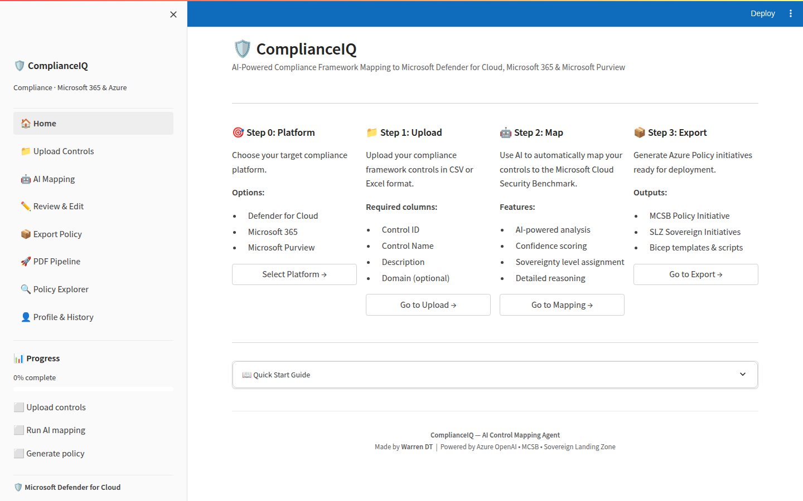
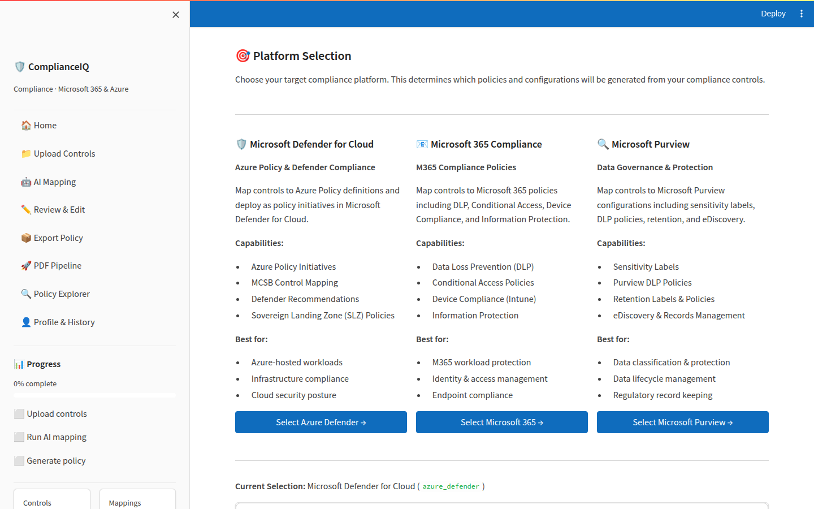
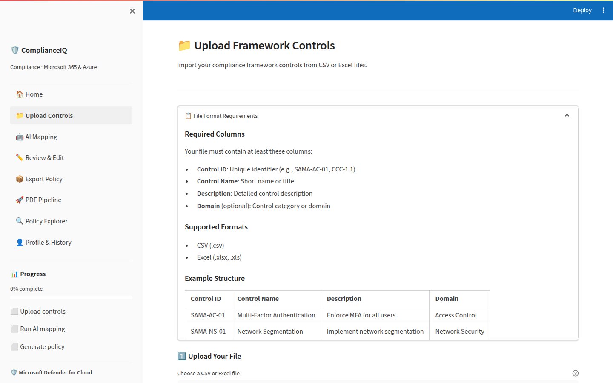

# UI Redesign Mockups — Microsoft 365 / Fluent 2

Rendered screenshots of the redesigned ComplianceIQ frontend on branch
`copilot/redesign-ui`. The shell follows the Microsoft 365 / Defender /
Purview model (Fluent 2 design tokens), not the Azure portal blade model.

> Captured at 1440 × 900 against a real Streamlit run on this branch
> (`streamlit run app.py`), no mockup tools or Photoshop.

---

## 1. Home

- **Suite header** (top): slim brand-blue strip (Fluent `colorBrandBackground` `#0F6CBD`)
  — replaces the previous gradient.
- **Left nav**: light neutral surface (`colorNeutralBackground2`), Fluent-style
  list rows. The selected item (Home here) shows the brand-tint fill +
  left accent bar.
- **Content canvas**: flat white, left-aligned Fluent largeTitle, generous
  whitespace, 4–8px corner radii on cards.
- Sidebar metrics use brand blue accents instead of cyan.

## 2. Platform Selection

- Three platform **cards** (Defender / M365 / Purview) — Fluent rounded
  corners + subtle elevation.
- Filled **primary brand buttons** with proper white labels on Microsoft
  blue (and hover/pressed ramps applied).
- Page title is a Fluent title rather than a gradient.

## 3. Upload Controls (sub-page selected state)

- Note the selected nav item: **"📁 Upload Controls"** in the sidebar
  has the brand-tint background + 3px brand-blue **accent bar on the left**.
- The "File Format Requirements" expander reads as a Fluent card
  (border + 6px radius + subtle elevation).
- The example **DataGrid** has the Fluent header style: neutral header
  fill, hairline bottom border, and brand-tint row hover.

---

## What's actually changed

Centralized in two files (propagating to all 9 pages):

| File | Change |
|---|---|
| `app/frontend/.streamlit/config.toml` | Added `[theme]` block (brand `#0F6CBD`, neutral surfaces, Segoe UI Variable) |
| `app/frontend/utils/theme.py` | Replaced Azure-gradient CSS with Fluent 2 tokens + component styling (suite header, nav tree, buttons, inputs, tabs, cards, alerts, tables, badges) |

Public helpers (`inject_azure_theme`, `render_sidebar`, `render_footer`)
keep their names so no per-page changes were needed.

For a true pixel-perfect Fluent build the brief recommends
`@fluentui/react-components` (a React rewrite). That's a bigger project;
this PR delivers the M365 look within Streamlit's constraints.
