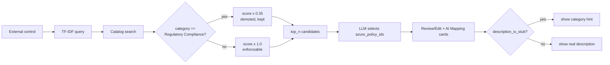

# Policy readability + mapping quality (2026-07-16)

Follow-up to `docs/readable-policy-names.md`. Two related fixes so the
Review/Edit and AI Mapping pages explain *what a policy is* and recommend
policies that actually *enforce* something.

## Problem

On the Review/Edit and AI Mapping pages, recommended Azure Policies rendered a
line that looked like a bare ID, e.g.:

```
Establish a secure software development program   (docs)
CMA_0259 - Establish a secure software development program
e750ca06-1824-464a-2cf3-d0fa754d1cb4
```

Two root causes:

1. **Stub descriptions.** The middle line is the policy's *real* Azure
   description. For Microsoft "Managed Control" (`CMA_*`) policies it just
   repeats the display name with a `CMA_xxxx` prefix. Verified against the live
   definition with `az policy definition show` - Azure itself returns exactly
   that string, so no cache refresh changes it. 558 / 2,465 catalog policies
   (23%) are these stubs; **all 557 `Regulatory Compliance` policies are stubs**
   and every stub is `Regulatory Compliance`.

2. **Mapping picked the wrong class.** TF-IDF retrieval surfaced `CMA_*`
   policies for nearly every control because their display names mirror control
   language ("Establish a secure software development program"). Those are
   manual-attestation controls with **no audit/deny effect**, and they crowded
   real enforceable policies out of the candidate list handed to the model.

## Fix

### 1. Suppress stub descriptions (UX)

- Backend flags each policy with `description_is_stub` in the
  `/api/v1/policy/details` response (`policy_cache_service._is_stub_description`:
  empty, exact repeat of the name, or `CMA_xxxx - <name>`).
- A shared frontend renderer (`components/policy_display.render_policy_list`,
  used by pages 2 and 3) hides the redundant line when it is a stub and shows a
  short category hint instead
  (`Regulatory Compliance - manual attestation control (no enforcement logic)`).
- Real Audit/Deny policies keep their informative description unchanged.

### 2. Demote non-enforceable policies (mapping quality)

- `policy_catalog_service.search` multiplies each candidate's relevance score by
  `policy_catalog_regulatory_penalty` (default **0.35**) when its category is
  `Regulatory Compliance`, so enforceable Audit/Deny policies rank first.
- Manual controls are **demoted, not dropped** - they remain a last-resort
  fallback when no enforceable policy fits (e.g. pure-governance controls such
  as "secure SDLC", for which Azure genuinely has no enforceable policy).
- The LLM candidate prompt reinforces the same preference.



## Verification

Local (all green):
- `test_policy_cache_catalog.py` - stub detection + `description_is_stub` flag (11 tests)
- `test_policy_catalog_service.py` - demotion ordering + score scaling (22 tests)
- `test_policy_display.py` - renderer hides stubs / keeps rich text / caches (4 tests)

Deployed dev (South Africa North):
- Backend `/api/v1/policy/details` returns `description_is_stub: true` +
  `category: "Regulatory Compliance"` for `e750ca06-...`.
- In-container catalog search: `penalty=0.35`, `Regulatory Compliance` in the
  top 6 for a governance query dropped from 6/6 to **1/6**; enforceable
  categories (Maps, App Platform) now surface.
- Frontend public URL returns HTTP 200 (clean boot).

## Config

| Setting | Default | Effect |
| --- | --- | --- |
| `policy_catalog_regulatory_penalty` | `0.35` | Ranking multiplier for `Regulatory Compliance` candidates. `1.0` disables demotion; lower pushes them further down. |

## Notes / unverified

- End-to-end UI rendering was verified structurally (unit tests + deployed API
  response), not by a fresh authenticated browser pass on pages 2/3.
- Pre-existing, out of scope: `test_policy_activity_recording.py` (3 tests) fail
  with `module 'app.api.routes.policy' has no attribute 'activity_service'` -
  fails with these changes stashed too, and it is not in the CI test set.
