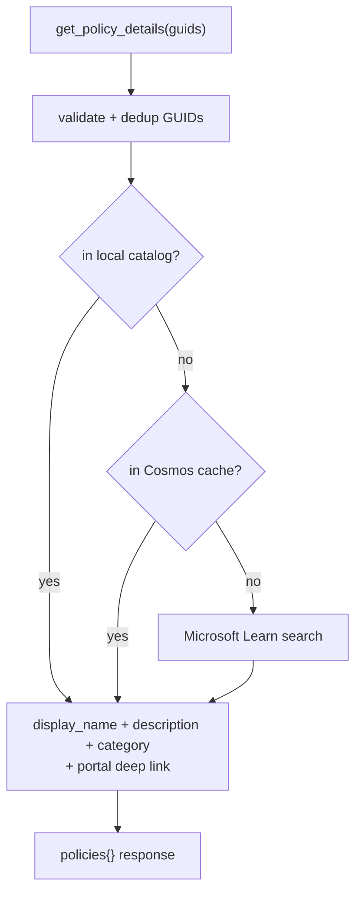

# Readable policy names & descriptions in the UI

**Status:** Done — deployed to dev (backend + frontend), verified live.

## Problem

The **Review / Edit** and **AI Mapping** pages listed recommended Azure
Policies as bare GUIDs rendered through a `Policy <guid>` stub, e.g.:

```
Policy afd5d60a-48d2-8073-1ec2-6687e22f2ddd — afd5d60a-… (docs)
```

That is unreadable for an end user who needs to understand *what* each
recommended policy actually does.

## Root cause

`PolicyCacheService.get_policy_details` resolved GUIDs only via:

1. Cosmos DB cache (empty for these GUIDs), then
2. a Microsoft Learn *search* keyed on the GUID string — which rarely
   matches, so it fell back to a synthesized `{"display_name": "Policy <guid>"}`
   stub.

It never consulted the local **Azure built-in policy catalog** (the ~2,465
definition snapshot added for full-catalog mapping), even though that snapshot
already carries every built-in policy's readable `display_name`, `description`
and `category` in memory.

## Fix

Add a **catalog-first** resolution pass. Cosmos and Learn remain as fallbacks
only for GUIDs that are genuinely not in the catalog (e.g. custom policies).



- The catalog lookup is in-memory and O(1) per GUID, so the common case
  resolves instantly with no Cosmos round-trip or Learn call.
- The `docs` link is a verified Azure Portal policy-definition deep link:
  `https://portal.azure.com/#view/Microsoft_Azure_Policy/PolicyDetailBlade/definitionId/{percent-encoded definitionId}`
  (format confirmed against Microsoft Learn).
- Both the Review/Edit and AI Mapping pages now render **name + description +
  GUID + docs link** instead of a raw code block.

## Files changed

| File | Change |
| --- | --- |
| `app/backend/app/services/policy_cache_service.py` | Catalog-first pass; `_from_catalog`; `_portal_definition_url`; `category` added to details |
| `app/frontend/pages/3_✏️_Review_Edit.py` | Render display name + description under each policy |
| `app/frontend/pages/2_🤖_AI_Mapping.py` | Same readable rendering (was raw GUID code blocks) |
| `app/tests/test_policy_cache_catalog.py` | New unit tests (catalog resolve, dedup, portal URL, fallthrough) |
| `.github/workflows/ci.yml` | Run the new test in the policy unit-test step |

## Verification

- `pytest app/tests/test_policy_cache_catalog.py` → 5 passed; policy suite 19 passed.
- Deployed backend (`/api/v1/policy/details`, exec'd in-container) returns
  `found 3` with readable names, e.g. *"Require notification of third-party
  personnel transfer or termination"*, plus descriptions and portal URLs.
- Frontend redeployed and boots clean (`You can now view your Streamlit app`,
  no ImportError, no upstream connection-refused); public URL returns 401
  (Easy Auth redirect), not a 5xx.

## Notes / unverified

- End-to-end browser confirmation of the rendered UI requires the interactive
  Microsoft (MFA) login and was not re-driven here; the change was verified at
  the API + boot level.
- GUIDs absent from the catalog still depend on the Cosmos/Learn fallback,
  which remains best-effort.
