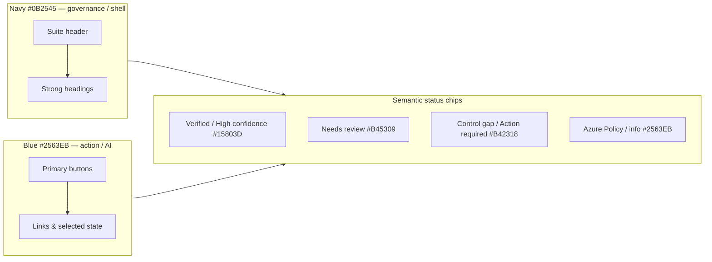
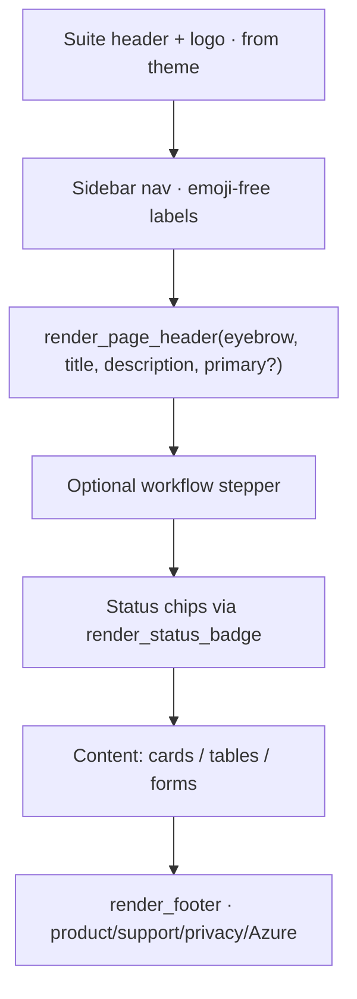

# ComplianceIQ Visual Design System

Handover for the `warrendt-visual-design-system` branch. This documents the
brand system, the shared component library, the page anatomy every screen now
follows, how to verify it, and the known caveats.

## Why

Two design reviews found the Streamlit app applied its theme inconsistently:
ad-hoc headings, emoji used as the primary status/visual device, hard-coded
per-page colours, loose column layouts, and a CSS-generated shield instead of
the real logo. Goal: make the app read as one composed, audit-ready
**ComplianceIQ** product — navy for governance/structure, vivid blue for
action/AI, restrained shared components, real branding, and semantic labelled
status chips instead of emoji.

## Brand tokens

Defined once in `app/frontend/utils/theme.py` (`:root` CSS variables) and mirrored
in `app/frontend/.streamlit/config.toml`. Never hard-code these values in a page —
reference the token.

| Role | Token | Value | Use |
|---|---|---|---|
| ComplianceIQ navy | `--brand-navy` | `#0B2545` | Shell, suite header, strong headings, structure |
| Intelligence blue | `--brand-primary` | `#2563EB` | Primary actions, active/selected, links, AI mapping |
| Light blue | (info surface) | `#EAF3FF` | Selected-card surfaces, subtle info panels |
| App canvas | `backgroundColor` | `#F8FAFC` | Page background |
| Card surface | — | `#FFFFFF` | Cards, forms, panels |
| Border | — | `#D9E2EC` | Card/input/divider outlines |
| Muted text | `--neutral-fg-3` | `#52606D` | Descriptions, supporting text |
| Verified / success | `--status-success` | `#15803D` | Approved, complete, high confidence |
| Needs review | `--status-warning` | `#B45309` | Review-required, caution |
| Risk / gap | `--status-danger` | `#B42318` | Control gaps, blocking errors |



## Shared component library

`app/frontend/utils/components.py` — pure, unit-tested HTML builders (`*_html`,
which `html.escape` their inputs) plus thin `render_*` Streamlit wrappers. This is
the single path for design-system UI; do not inline bespoke markup on pages.

| Builder | Wrapper | Purpose |
|---|---|---|
| `page_header_html` | `render_page_header` | Eyebrow + title + description + optional single primary |
| `workflow_stepper_html` | `render_workflow_stepper` | Govern → Map → Enforce → Report lifecycle |
| `status_badge_html` | `render_status_badge` | Sole path for status/confidence chips |
| `confidence_status` | — | Maps a score to a chip variant (see below) |
| `metric_card_html` | `render_metric_card` | KPI cards on Home |
| `selection_card_html` | `render_selection_card` | Framework/platform choice cards |
| `empty_state_html` | `render_empty_state` | Consistent empty states |
| `section_heading_html` | `render_section_heading` | In-page section headings |

`confidence_status(score)`: values `> 1.0` are treated as percentages (÷100);
`>= 0.85` → success / "High confidence", `>= 0.6` → warning / "Needs review",
else danger / "Low confidence".

Lifecycle stages: `LIFECYCLE_STAGES = ("Govern", "Map", "Enforce", "Report")`.

## Page anatomy

Every workflow page now opens with the same shell and order:



- One filled primary action per viewport; secondary actions are outline/text.
- Status is communicated **only** by labelled chips — no emoji, no hard-coded hex.
- Home (`app.py`) is a control-tower dashboard: page header + stepper + 3 KPI
  cards + a single Continue action.

## Page files are emoji-free

All `pages/*.py` were renamed to drop emoji (e.g. `2_🤖_AI_Mapping.py` →
`2_AI_Mapping.py`). This is **routing-safe**: Streamlit strips both the numeric
prefix and a leading emoji when deriving a page's URL slug, and `nginx.conf`
already routes on the emoji-free slugs (`/AI_Mapping`, `/Export_Policy`, …). So
URLs and nginx are unchanged; only literal `pages/…​.py` string references were
updated (deep-link map, `switch_page`, `page_link`, task status bar, and test
fixtures).

## Guarding the result

- **Streamlit is pinned** (`streamlit==1.37.0` in `frontend/requirements.txt`) —
  the theme depends on `data-testid` / Base Web selectors that can drift between
  Streamlit versions.
- **Design-guard tests** (`app/tests/test_frontend_design_guard.py`) assert,
  deterministically: page filenames and sidebar nav labels stay emoji-free, no
  source/test file references an old emoji page path, and the brand navy/blue
  tokens remain declared in the theme.
- **Why not pixel screenshots:** a Playwright screenshot-regression suite needs
  committed binary baselines and deterministic font rendering — unreliable in a
  public repo / CI. The static guard covers the invariants that actually break
  the design system, without the flakiness.

## Verify

```bash
# Unit + guard tests (session venv; local python is PEP-668 managed)
cd app
PYTHONPATH=backend:frontend <venv>/bin/python -m pytest \
  tests/test_frontend_components.py tests/test_frontend_design_guard.py \
  tests/test_frontend_landing.py tests/test_frontend_auth.py \
  tests/test_frontend_responsive_content.py tests/test_task_status_bar.py \
  tests/test_version_history_ui.py tests/test_fragment_polling.py -q
# → 93 passed

# Deploy (image only — never provision/up)
azd deploy frontend --no-prompt
```

## Caveats / honest status

- **Live pixel verification is blocked.** The deployed container is up and the
  Entra login flow routes correctly, but two things prevent seeing the rendered
  screens without credentials:
  1. Anonymous root currently returns `RedirectToLoginPage` (Easy Auth). The
     landing branch's `AllowAnonymous` has drifted back at the platform level (a
     later `azd provision` from another branch reset it — `azd deploy` does not
     touch auth config). Restoring it is an auth-config write, out of scope for a
     visual pass; flag to Warren if the anonymous branded landing must be visible.
  2. Authenticated screens need a real MFA sign-in. The design system is
     validated by the 93 deterministic unit/guard tests instead.
- **Branch overlap.** This branch stacks on the unmerged
  `warrendt-branded-entra-landing-page`; it will not merge to `main` until that
  does. Keep the landing branch's `state_init.py` (5 funcs) — do not import the
  canonical `state_init` from the mapping branch, which would break these pages.
- **ARM token store empty** (`/.auth/me` → `[]`) is a separate, pre-existing
  runtime blocker — untouched here.
- No environment-specific identifiers (subscription/tenant/RG/hostname/email) are
  committed in this doc or the code changes (public repo).
