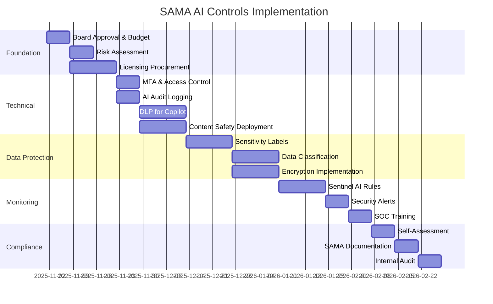

# Executive Summary: SAMA CSF AI Controls Integration

## Document Overview
Integration of Azure AI Foundry and Microsoft 365 Copilot controls into existing SAMA Cyber Security Framework compliance program for Saudi financial institutions.

**Target Audience**: Board of Directors, C-Suite, SAMA Compliance Officers  
**Classification**: Internal - Strategic  
**Date**: October 31, 2025

---

## Executive Summary

### Business Context
Financial institutions in Saudi Arabia deploying generative AI technologies (Azure AI Foundry for custom AI applications, Microsoft 365 Copilot for productivity) must ensure compliance with SAMA Cyber Security Framework v1.0. This document extends existing SAMA controls to cover AI-specific risks.

### Key Findings

**Compliance Status**: 95 new AI-specific controls mapped across all SAMA domains (3.1-3.4)

**Critical Gaps Addressed**:
1. Prompt injection and jailbreak attacks (3.2.1)
2. AI data leakage and oversharing (3.3.3, 3.3.9)
3. Shadow AI tool usage (3.3.16)
4. AI model governance and transparency (3.2.2)
5. Privileged AI access management (3.3.5)

**Investment Required**:
- Small institution (100 users): SAR 42,000/month
- Medium institution (500 users): SAR 204,375/month
- Large bank (2000+ users): SAR 802,500/month

**Implementation Timeline**: 60-90 days for full AI security baseline

---

## AI-Specific Risk Landscape

### Critical AI Threats for Financial Institutions

| Threat | Impact | Likelihood | SAMA Control | Mitigation |
|--------|--------|-----------|--------------|------------|
| **Prompt Injection** | High | High | 3.2.1.AI.3 | Azure AI Content Safety |
| **AI Data Exfiltration** | Critical | Medium | 3.2.1.AI.4 | Purview DLP for Copilot |
| **Model Poisoning** | High | Low | 3.3.16.AI.3 | Model integrity validation |
| **Shadow AI Usage** | Medium | High | 3.3.16.AI.5 | Defender for Cloud Apps |
| **PII Leakage** | Critical | Medium | 3.3.13.AI.5 | Copilot DLP policies |
| **Unauthorized Deployment** | High | Medium | 3.3.6.AI.6 | Change management gates |

### AI Risk Quantification

**Prompt Injection Attack**:
- Probability: 15% annually
- Impact: SAR 2-5M (data breach, regulatory fines)
- Mitigation cost: SAR 500K/year (Content Safety + monitoring)
- ROI: 4:1 to 10:1

**AI Data Leakage via Copilot**:
- Probability: 25% annually (without controls)
- Impact: SAR 1-3M (GDPR violations, customer trust)
- Mitigation cost: SAR 2.4M/year (M365 E5 for 100 users)
- ROI: Mandatory for SAMA compliance

---

## SAMA Compliance Mapping

### Coverage Across SAMA Domains

| SAMA Domain | AI Controls Added | Priority | Completion Target |
|-------------|------------------|----------|-------------------|
| 3.1 Governance | 15 controls | Critical | Week 1-2 |
| 3.2 Risk Management | 22 controls | Critical | Week 3-4 |
| 3.3 Operations | 48 controls | High | Week 5-8 |
| 3.4 Third Party | 10 controls | Medium | Week 9-10 |
| **Total** | **95 controls** | **Mixed** | **60-90 days** |

### Licensing Requirements Summary

**Minimum Licensing for SAMA AI Compliance**:
- Microsoft 365 E5 (includes Purview, Defender XDR, Copilot base)
- Copilot for Microsoft 365 ($30/user/month additional)
- Azure subscription (AI Foundry, Defender for Cloud)
- Azure AI Content Safety (variable usage)

**Alternative for E3 Customers**:
- Upgrade to E5 (recommended) OR
- Add-on licenses: Purview E5, Defender for Office 365 P2, Entra ID P2

---

## Strategic Recommendations

### Immediate Actions (Next 30 Days)

1. **Board Approval** (Week 1)
   - Present AI adoption strategy to board
   - Obtain approval for AI budget allocation
   - Establish AI governance committee with SAMA representation

2. **Risk Assessment** (Week 2)
   - Complete AI-specific risk assessment using Microsoft RAI framework
   - Identify high-risk AI use cases requiring SAMA pre-approval
   - Document AI risk appetite and tolerance levels

3. **Licensing Procurement** (Week 3)
   - Procure Microsoft 365 E5 licenses for AI users
   - Enable Azure AI services in Saudi Arabia region
   - Configure Defender for Cloud AI workload protection

4. **Quick Wins** (Week 4)
   - Deploy MFA for AI resource access
   - Enable Copilot audit logging (7-year retention)
   - Configure DLP to block PII in Copilot prompts
   - Deploy prompt injection detection

### Medium-Term Priorities (Days 31-90)

5. **Data Classification** (Weeks 5-7)
   - Deploy Purview sensitivity labels for AI training data
   - Classify existing data for AI readiness
   - Implement automated labeling policies

6. **Network Isolation** (Weeks 8-10)
   - Deploy AI Foundry in VNet with private endpoints
   - Configure NSG rules for AI traffic segmentation
   - Implement DDoS protection for AI APIs

7. **Monitoring & Detection** (Weeks 11-12)
   - Deploy Sentinel analytics rules for AI threats
   - Configure AI-specific security alerts
   - Train SOC team on AI incident response

8. **Compliance Validation** (Week 13)
   - Complete SAMA AI controls self-assessment
   - Generate compliance evidence for SAMA audit
   - Schedule internal AI security review

### Long-Term Strategic Initiatives (90+ Days)

9. **Continuous Improvement**
   - Quarterly AI security posture assessments
   - Annual AI penetration testing (OWASP Top 10 for LLM)
   - Bi-annual review of AI governance policies

10. **Capability Building**
    - AI security training for security team
    - Responsible AI training for developers
    - Executive AI risk awareness sessions

---

## Financial Analysis

### Total Cost of Ownership (3 Years)

**Medium Financial Institution (500 users)**

| Component | Year 1 | Year 2 | Year 3 | Total |
|-----------|--------|--------|--------|-------|
| M365 E5 + Copilot | SAR 2.45M | SAR 2.45M | SAR 2.45M | SAR 7.35M |
| Azure AI Foundry | SAR 36K | SAR 36K | SAR 36K | SAR 108K |
| Defender + Monitoring | SAR 96K | SAR 96K | SAR 96K | SAR 288K |
| Implementation (Year 1) | SAR 300K | - | - | SAR 300K |
| Training & Awareness | SAR 50K | SAR 30K | SAR 30K | SAR 110K |
| **Total** | **SAR 2.93M** | **SAR 2.58M** | **SAR 2.58M** | **SAR 8.16M** |

**Cost per User per Month**: SAR 1,362 (Year 1), SAR 1,290 (Years 2-3)

### ROI Justification

**Cost of Non-Compliance**:
- SAMA regulatory fines: SAR 1M - 50M per incident
- Data breach costs: Average SAR 15M for financial institutions
- Reputational damage: 20-40% customer attrition
- Loss of SAMA operating license: Business extinction

**Cost of AI Compliance**:
- SAR 8.16M over 3 years (500 users)
- **Break-even point**: Prevention of single major AI incident

**Productivity Benefits** (Not included in ROI):
- Copilot productivity gains: 29% (Microsoft study)
- Automated threat detection: 40% faster MTTD
- Reduced manual compliance work: 60% efficiency gain

---

## Implementation Roadmap

**Critical Path**: 90 days from approval to SAMA compliance readiness

---

## Risk & Mitigation

### Implementation Risks

| Risk | Impact | Mitigation |
|------|--------|------------|
| Budget constraints | High | Phased rollout, start with critical controls |
| Resistance to change | Medium | Executive sponsorship, user training |
| Technical complexity | Medium | Microsoft Premier Support, external consultants |
| Skills gap | High | Training program, hire AI security specialist |
| Vendor lock-in concerns | Low | Multi-cloud strategy, data portability clauses |

### Operational Risks (Post-Implementation)

| Risk | Impact | Mitigation |
|------|--------|------------|
| False positive AI alerts | Medium | Continuous tuning, SOC feedback loops |
| AI performance degradation | Low | Model monitoring, automated retraining |
| Compliance drift | High | Quarterly reviews, automated policy enforcement |
| Shadow AI proliferation | Medium | CASB policies, user awareness |

---

## Governance Structure

### AI Governance Committee

**Chair**: Chief Risk Officer or CISO

**Members**:
- Chief Information Security Officer (CISO)
- Chief Data Officer (CDO)
- Chief Technology Officer (CTO)
- Head of Compliance
- Head of Legal
- Head of Internal Audit
- Business unit representatives

**Frequency**: Monthly (first 6 months), then Quarterly

**Responsibilities**:
1. Approve AI use cases and risk assessments
2. Review AI security incidents and lessons learned
3. Monitor AI compliance with SAMA framework
4. Approve AI policies and standards
5. Escalate high-risk AI issues to board

### SAMA Reporting Requirements

**Immediate Notification** (within 1 hour):
- Critical AI security incidents
- Large-scale data breaches via AI
- AI system unavailability >4 hours
- Prompt injection leading to unauthorized access

**Regular Reporting**:
- Quarterly: AI compliance status
- Annual: AI risk assessment results
- Upon request: AI incident forensics reports

---

## Decision Matrix

### Should We Deploy AI Now?

**YES - Deploy Immediately If**:
- ✅ Competitive pressure (peers adopting AI)
- ✅ Clear business use cases with ROI >2:1
- ✅ Budget approved for compliance controls
- ✅ Executive sponsorship secured
- ✅ SAMA CSF baseline already compliant

**WAIT - Defer If**:
- ❌ Current SAMA compliance <80%
- ❌ No dedicated AI security budget
- ❌ Insufficient IT security staffing
- ❌ Major cybersecurity incidents in last 12 months
- ❌ Lack of board-level AI understanding

**DO NOT DEPLOY If**:
- 🛑 SAMA audit failures in past 2 years
- 🛑 Active regulatory investigation
- 🛑 No data classification program
- 🛑 Public cloud prohibited by policy
- 🛑 Unable to implement MFA/encryption

---

## Conclusion

### Key Takeaways

1. **AI is Inevitable**: Financial institutions must prepare for AI adoption - competitors are already deploying.

2. **SAMA Compliance is Achievable**: Existing SAMA controls extend logically to AI with 95 new specific controls.

3. **Investment is Justified**: Cost of non-compliance far exceeds cost of compliance controls.

4. **Timeline is Aggressive**: 90-day implementation requires executive commitment and adequate resources.

5. **Microsoft Stack Simplifies**: Integrated Microsoft security stack (E5, Defender, Purview) provides comprehensive coverage.

### Recommended Next Steps

**Board Action Required**:
1. Approve AI adoption strategy and SAMA compliance roadmap
2. Allocate budget: SAR 2.93M (Year 1) for 500 users
3. Appoint AI Governance Committee chair
4. Set target: SAMA AI compliance within 90 days

**Management Action Required**:
1. Establish AI Governance Committee
2. Procure Microsoft 365 E5 licenses
3. Engage Microsoft Premier Support or implementation partner
4. Schedule SAMA pre-consultation for AI deployment

**Technical Action Required**:
1. Deploy critical AI security controls (Week 1-4)
2. Complete AI risk assessment
3. Configure AI monitoring and detection
4. Train SOC team on AI threats

---

## Appendix: Key Documents Delivered

1. **SAMA_AI_Foundry_Copilot_Controls.md** - Comprehensive control mapping (95 controls)
2. **SAMA_AI_Controls_Tracker.csv** - Implementation tracker with priorities
3. **SAMA_AI_Quick_Reference.md** - Tactical deployment guide
4. **Executive_Summary.md** - This document

All documents reference official SAMA CSF v1.0 (May 2017) and Microsoft official documentation as of October 2025.

---

## Contact & Support

**Internal Escalation**:
- CISO Office: ciso@organization.sa
- AI Governance Committee: ai-committee@organization.sa

**External Support**:
- SAMA Cyber Security: cybersecurity@sama.gov.sa
- Microsoft Premier Support: Azure Portal
- Microsoft AI Security: aisecurity@microsoft.com

**Authors**: Cloud Security Architecture Team  
**Reviewers**: CISO, Head of Compliance, External AI Security Consultant  
**Approval**: Pending Board Review  
**Next Review**: January 31, 2026

---

*This executive summary provides strategic guidance for AI compliance with SAMA CSF. Technical implementation requires validation with internal compliance, legal, and technical teams. Obtain SAMA approval before deploying AI systems processing customer financial data.*
